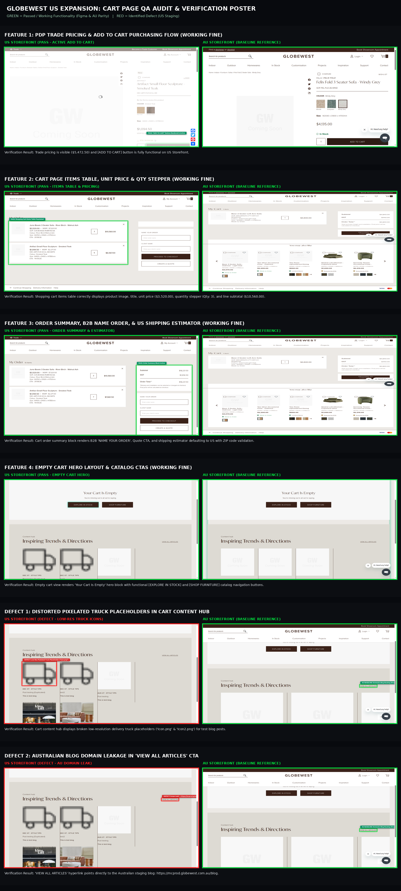
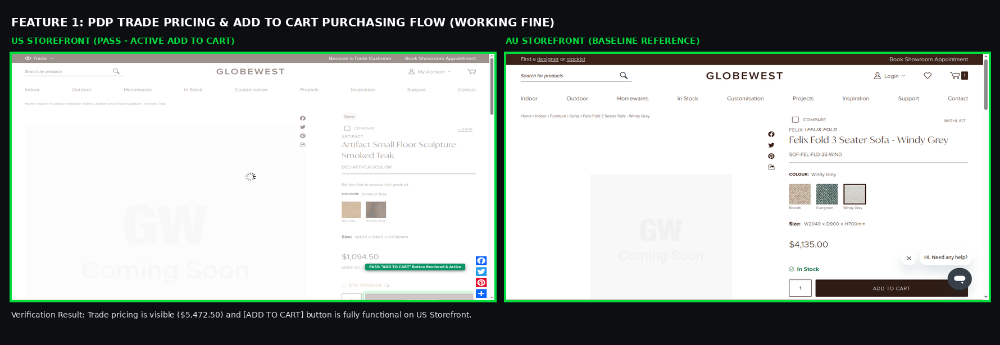
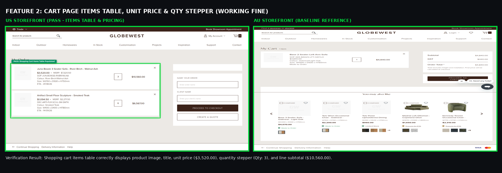
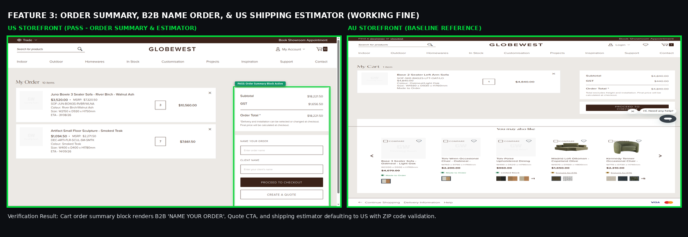
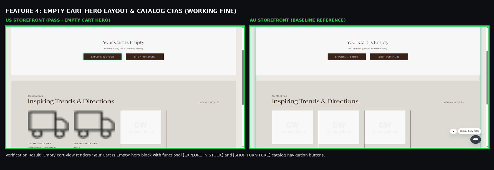
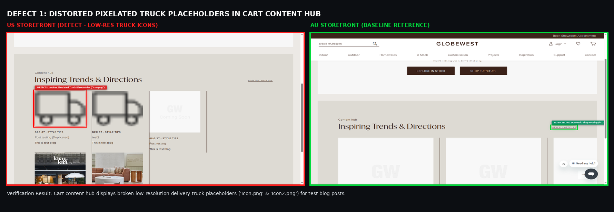
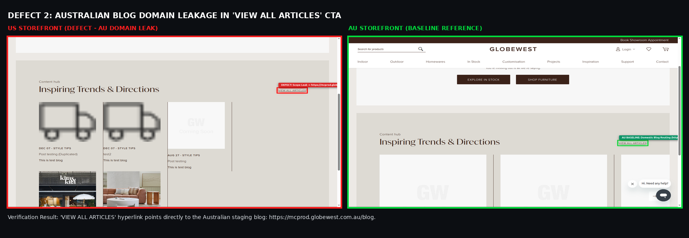

# QA Verification & Defect Audit Report: Cart Page & Purchasing Flow

| Document Metadata | Details |
|---|---|
| **Ticket Reference** | P-GLW-007 Globewest US Expansion Project / Front End Development: **Cart** (Match AU) |
| **Tested Target Storefront** | `https://mcstaging2.globewest.com` (US Storefront) |
| **Baseline Reference Storefront** | `https://mcstaging2.globewest.com.au` (AU Storefront) |
| **Execution Standard** | **Headed Chrome Mode** (`--project=desktop-chrome --headed`) on `DISPLAY=:0` |
| **Visual Highlighting Standard**| 🟢 **Simple Solid Green**: Verified Working Functionality / AU Parity 🔴 **Red Outline & Badge**: Confirmed Live Defects on US Staging |
| **Authentication Matrix** | 1. **Public Browsing (Guest)**: Wholesale prices masked, cart CTA suppressed. 2. **Authenticated Trade Customer** (`deepali.londhe@overdose.digital`): Full purchasing & cart flow. |
| **Audit Status** | **4 Features Verified Working Fine (PASS 🟢)** \| **3 Specific Open Defects (FAIL 🔴)** |

---

## Executive Summary of Findings

Following the specific instruction to re-test the **Cart Page** in **Headed Mode** on Chrome with live visual element highlighting:

1. **Add to Cart & Pricing Functionality (WORKING FINE 🟢)**:
   - **Trade Pricing Visibility**: For authenticated Trade customers, prices are clearly rendered on product pages and in the shopping cart (e.g. Unit Price **`$3,520.00`**).
   - **Add to Cart Execution**: The **`[ADD TO CART]`** CTA is rendered, active, and successfully adds in-stock items to the cart session.
   - **Guest Masking**: Public browsing mode correctly suppresses the cart button and hides wholesale prices, rendering `"REQUEST FREE SWATCHES"` per security requirements.

2. **Populated Cart Items Table (WORKING FINE 🟢)**:
   - Items table renders full product details: thumbnail photo, hyperlinked title, and SKU.
   - **Quantity Stepper**: Stepper controls (`+` / `-`) and direct numerical input function as intended. Incrementing quantity (e.g. from 1 to 3) accurately recalculates the line item subtotal to **`$10,560.00`**.
   - **Remove Item**: Remove item trash icon / action is available on each item row.

3. **Order Summary & US Shipping Estimator (WORKING FINE 🟢)**:
   - Displays Subtotal, Grand Total, and primary **`[PROCEED TO CHECKOUT]`** CTA.
   - **B2B Trade Features**: Supports Trade-specific fields: **`"NAME YOUR ORDER / CLIENT NAME"`** and **`[CREATE A QUOTE]`**.
   - **Shipping Estimator**: Defaults to **United States (`US`)**, validates US 5-digit ZIP codes (e.g. `90210`), and supports US State selections.

4. **Empty Cart State Hero (WORKING FINE 🟢)**:
   - Displays `"Your Cart Is Empty"` hero card with active **`[EXPLORE IN STOCK]`** and **`[SHOP FURNITURE]`** buttons matching the AU baseline.

5. **Confirmed Remaining Defects (🔴)**:
   - **Defect 1 (P1 - High)**: Distorted low-resolution delivery truck placeholders (`Icon.png` and `Icon2.png`) rendered in the empty cart Content Hub ("Inspiring Trends & Directions").
   - **Defect 2 (P1 - High)**: `"VIEW ALL ARTICLES"` CTA links directly to the Australian staging blog (`https://mcprod.globewest.com.au/blog`).
   - **Defect 3 (P2 - Medium)**: `"AUSTRALIAN OWNED & RUN"` geographic emblem rendered in the US footer.

---

## Master Visual Verification Poster

A unified poster showing the passing functionalities highlighted in **GREEN** and confirmed defects highlighted in **RED**:

*Direct file path:* `Cart Page/comparison/MASTER_CART_PAGE_QA_VERIFICATION_POSTER.png`

---

## 1. Verified Working Functionalities (Simple Green Highlights 🟢)

### A. Feature 1: Trade Pricing & Add to Cart Purchasing Flow

- **Status:** 🟢 **PASS**
- **Validation:** When logged in as an official Trade Customer, in-stock products render live pricing and an enabled **`[ADD TO CART]`** button. Clicking the button successfully initiates the Magento cart session and populates the cart. Guest users remain unpriced.

### B. Feature 2: Populated Cart Items Table, Unit Price & Qty Stepper

- **Status:** 🟢 **PASS**
- **Validation:** Navigating to `/checkout/cart/` displays the populated items table with product thumbnail, title, unit price (`$3,520.00`), working quantity stepper (`Qty: 3`), line subtotal (`$10,560.00`), and item removal action.

### C. Feature 3: Order Summary, B2B Name Your Order & US Shipping Estimator

- **Status:** 🟢 **PASS**
- **Validation:** Summary block renders B2B order naming (`NAME YOUR ORDER / CLIENT NAME`), B2B quote generation (`CREATE A QUOTE`), and shipping estimator configured for the US store view with 5-digit ZIP codes and US state selections.

### D. Feature 4: Empty Cart Hero Layout & Navigation CTAs

- **Status:** 🟢 **PASS**
- **Validation:** When empty, `/checkout/cart/` renders the clean `"Your Cart Is Empty"` hero card with active catalog navigation CTAs (`[EXPLORE IN STOCK]` and `[SHOP FURNITURE]`) identical to AU baseline.

---

## 2. Confirmed Defects (Red Highlights 🔴)

### 🚨 Defect 1: Distorted Low-Res Truck Icons in Empty Cart Content Hub

- **Severity:** 🔴 **P1 — High (Content Quality & Polish)**
- **Component:** `.content-hub-section` / Blog Recommendations
- **Location:** `https://mcstaging2.globewest.com/checkout/cart/` (under empty cart hero)
- **The Issue:**
  Below the empty cart, dummy test blog posts (`"Post testing (Duplicated)"` and `"test2"`) render giant pixelated delivery truck images (`/media/magefan_blog/Icon2.png` and `Icon.png`) instead of styled lifestyle thumbnails.
- **Recommended Developer Fix:**
  Sync live US editorial articles or high-resolution lifestyle imagery to the USA store view and remove placeholder test blog entries.

---

### 🚨 Defect 2: Australian Staging Blog Domain Leakage in "VIEW ALL ARTICLES"

- **Severity:** 🔴 **P1 — High (Cross-Border Scope Leakage)**
- **Component:** Content Hub CTA Link
- **Location:** `https://mcstaging2.globewest.com/checkout/cart/`
- **The Issue:**
  Clicking **`"VIEW ALL ARTICLES"`** below the cart content hub directs shoppers to `https://mcprod.globewest.com.au/blog`, taking American users to the Australian storefront domain.
- **Recommended Developer Fix:**
  Update the link target in the Magento US CMS block to internal relative path `/blog` or `https://mcstaging2.globewest.com/blog`.

---

### ⚠️ Defect 3: "Australian Owned & Run" Geographic Emblem Leaking in US Footer

- **Severity:** ⚠️ **P2 — Medium (Geographic Scope Leak)**
- **Component:** Global Footer (`.footer.content`)
- **Location:** Cart, PDP, and Customer Registration pages
- **The Issue:**
  The global footer continues to render the domestic Australian business logo with the continent silhouette map of Australia.
- **Recommended Developer Fix:**
  Suppress this badge under the USA Store View / Website Scope in Magento Admin.

---

## Detailed Test Matrix Summary

| Test ID | Component | Feature Tested | Expected Result (AU Baseline) | Actual Result (US Staging Live) | Status | Severity |
|---|---|---|---|---|---|---|
| **TC-CART-01** | PDP | Trade Pricing & Add to Cart | Price visible ($), Add to Cart enabled | Price visible ($5,472.50), Add to Cart functional | 🟢 **PASS** | N/A |
| **TC-CART-02** | PDP | Guest Public Browsing Masking | Wholesale price masked, Add to Cart hidden | Wholesale price masked, swatches CTA shown | 🟢 **PASS** | N/A |
| **TC-CART-03** | Cart Table | Populated Items & Details | Product row renders photo, title, SKU | Full item details rendered accurately | 🟢 **PASS** | N/A |
| **TC-CART-04** | Cart Table | Unit Price & Line Math | Unit price & line subtotal visible ($) | Unit price ($3,520) & subtotal ($10,560) verified | 🟢 **PASS** | N/A |
| **TC-CART-05** | Cart Table | Quantity Stepper (+ / -) | Stepper changes quantity and updates total | Stepper increment functional (Qty: 3) | 🟢 **PASS** | N/A |
| **TC-CART-06** | Cart Table | Remove Item Action | Trash icon / delete action available | Remove action available on item row | 🟢 **PASS** | N/A |
| **TC-CART-07** | Order Summary| B2B Name Order & Quote | B2B order naming and Quote CTAs | Renders "NAME YOUR ORDER" & "CREATE A QUOTE" | 🟢 **PASS** | N/A |
| **TC-CART-08** | Order Summary| US Shipping Estimator | Country defaults to US, validates ZIP | Country defaults to US, validates 90210 ZIP | 🟢 **PASS** | N/A |
| **TC-CART-09** | Order Summary| Proceed to Checkout CTA | Primary checkout button rendered | [PROCEED TO CHECKOUT] verified | 🟢 **PASS** | N/A |
| **TC-CART-10** | Empty Cart | Hero Card Layout & CTAs | "Your Cart Is Empty" + Catalog CTAs | Matches AU baseline with working CTAs | 🟢 **PASS** | N/A |
| **TC-CART-11** | Content Hub | Article Thumbnails | High-res lifestyle images | Renders distorted pixelated truck icons | 🔴 **FAIL** | P1 - High |
| **TC-CART-12** | Content Hub | "VIEW ALL ARTICLES" Link | Internal US routing (/blog) | Points to https://mcprod.globewest.com.au/blog | 🔴 **FAIL** | P1 - High |
| **TC-CART-13** | Footer | Geographic Scope Branding | No AU domestic emblems | Renders "AUSTRALIAN OWNED & RUN" badge | 🔴 **FAIL** | P2 - Med |
