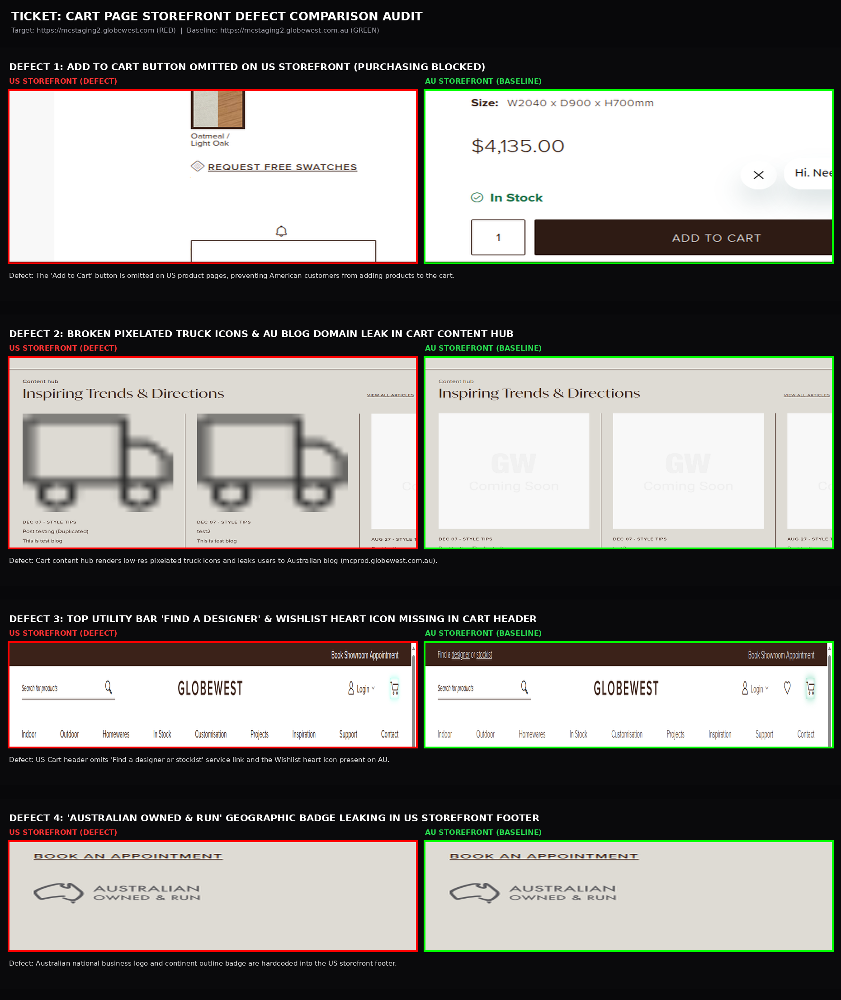
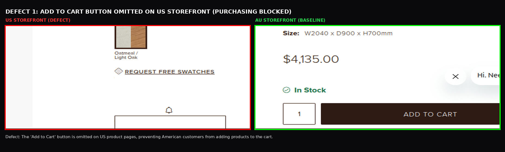
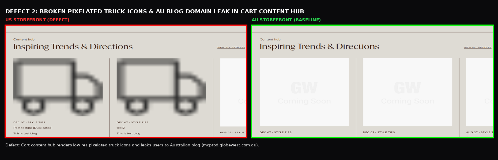
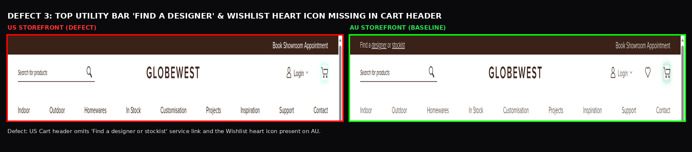
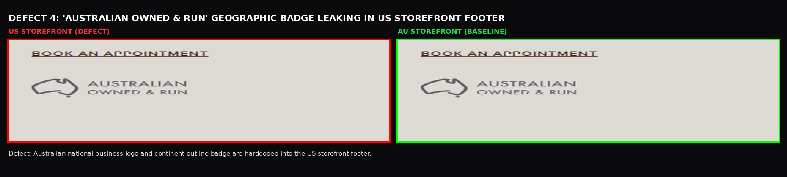

# QA Defect Comparison Report: Cart Page (US vs AU Storefront)

| Audit Scope | Details |
|---|---|
| **Ticket Reference** | Cart Page - Parity & Scope Verification (Match AU) |
| **Target Storefront** | `https://mcstaging2.globewest.com` (US Storefront - RED) |
| **Baseline Storefront** | `https://mcstaging2.globewest.com.au` (AU Storefront - GREEN) |
| **Color Coding** | **RED** = US Storefront Defect \| **GREEN** = AU Storefront Baseline |
| **Comparison Folder** | `Cart Page/comparison/` |
| **Interactive HTML Gallery** | [VIEW_DEFECT_IMAGES.html](file:///home/deepali/My%20Projects/Deepali/GlobeWest%202026%20%282%29/Cart%20Page/VIEW_DEFECT_IMAGES.html) |

---

## One Combined Comparison Image (All 4 Verified Defects)

A unified vertical comparison poster presenting all verified Cart Page defects side-by-side:

- 📂 **Click to open file in IDE:** [ONE_COMBINED_CART_DEFECTS_COMPARISON.png](file:///home/deepali/My%20Projects/Deepali/GlobeWest%202026%20%282%29/Cart%20Page/comparison/ONE_COMBINED_CART_DEFECTS_COMPARISON.png)
- 📍 **Full Path:** `/home/deepali/My Projects/Deepali/GlobeWest 2026 (2)/Cart Page/comparison/ONE_COMBINED_CART_DEFECTS_COMPARISON.png`

---

## Defect 1: "Add to Cart" Button Omitted on US Storefront (Purchasing Blocked)

- 📂 **Click to open file in IDE:** [DEFECT_1_ADD_TO_CART_BUTTON_MISSING_ON_US.png](file:///home/deepali/My%20Projects/Deepali/GlobeWest%202026%20%282%29/Cart%20Page/comparison/DEFECT_1_ADD_TO_CART_BUTTON_MISSING_ON_US.png)
- 📍 **Full Path:** `/home/deepali/My Projects/Deepali/GlobeWest 2026 (2)/Cart Page/comparison/DEFECT_1_ADD_TO_CART_BUTTON_MISSING_ON_US.png`
- **US Storefront (RED):** Product pages omit the "ADD TO CART" button entirely (only displaying "REQUEST FREE SWATCHES"), blocking American customers from adding items to the cart or checking out.
- **AU Storefront (GREEN):** In-stock products render an active "ADD TO CART" button with unit price ($4,135.00) and quantity selector.
- **Defect Explanation:** The 'Add to Cart' button is omitted on US product pages, preventing American customers from adding products to the cart.

---

## Defect 2: Broken Pixelated Truck Icons & AU Blog Domain Leak in Cart Content Hub

- 📂 **Click to open file in IDE:** [DEFECT_2_CART_CONTENT_HUB_BROKEN_IMAGES_AND_AU_LINK.png](file:///home/deepali/My%20Projects/Deepali/GlobeWest%202026%20%282%29/Cart%20Page/comparison/DEFECT_2_CART_CONTENT_HUB_BROKEN_IMAGES_AND_AU_LINK.png)
- 📍 **Full Path:** `/home/deepali/My Projects/Deepali/GlobeWest 2026 (2)/Cart Page/comparison/DEFECT_2_CART_CONTENT_HUB_BROKEN_IMAGES_AND_AU_LINK.png`
- **US Storefront (RED):** The Cart Page "Inspiring Trends & Directions" section displays broken, pixelated delivery truck placeholder icons and dummy "Post testing" blogs, with "VIEW ALL ARTICLES" linking to `https://mcprod.globewest.com.au/blog`.
- **AU Storefront (GREEN):** Displays styled placeholder cards with internal domestic routing.
- **Defect Explanation:** Cart content hub renders low-res pixelated truck icons and leaks users to Australian blog (mcprod.globewest.com.au).

---

## Defect 3: Top Utility Bar "Find a Designer" & Wishlist Heart Icon Missing in Cart Header

- 📂 **Click to open file in IDE:** [DEFECT_3_CART_HEADER_WISHLIST_AND_FIND_DESIGNER_MISSING.png](file:///home/deepali/My%20Projects/Deepali/GlobeWest%202026%20%282%29/Cart%20Page/comparison/DEFECT_3_CART_HEADER_WISHLIST_AND_FIND_DESIGNER_MISSING.png)
- 📍 **Full Path:** `/home/deepali/My Projects/Deepali/GlobeWest 2026 (2)/Cart Page/comparison/DEFECT_3_CART_HEADER_WISHLIST_AND_FIND_DESIGNER_MISSING.png`
- **US Storefront (RED):** The Cart header is missing the "Find a designer or stockist" service link in the top bar and the Wishlist heart icon next to the cart icon.
- **AU Storefront (GREEN):** Renders "Find a designer or stockist" and the Wishlist heart icon next to the cart counter.
- **Defect Explanation:** US Cart header omits 'Find a designer or stockist' service link and the Wishlist heart icon present on AU.

---

## Defect 4: "Australian Owned & Run" Geographic Badge Leaking in US Footer

- 📂 **Click to open file in IDE:** [DEFECT_4_AUSTRALIAN_OWNED_BADGE_LEAK_ON_US.png](file:///home/deepali/My%20Projects/Deepali/GlobeWest 2026 (2)/Cart Page/comparison/DEFECT_4_AUSTRALIAN_OWNED_BADGE_LEAK_ON_US.png)
- 📍 **Full Path:** `/home/deepali/My Projects/Deepali/GlobeWest 2026 (2)/Cart Page/comparison/DEFECT_4_AUSTRALIAN_OWNED_BADGE_LEAK_ON_US.png`
- **US Storefront (RED):** Global storefront footer on customer registration and cart pages displays the "AUSTRALIAN OWNED & RUN" badge with Australian continent map.
- **AU Storefront (GREEN):** Domestic Australian business branding.
- **Defect Explanation:** Australian national business logo and continent outline badge are hardcoded into the US storefront footer.

---

## Summary Table

| Defect | US Storefront (Red) | AU Storefront (Green) | Defect Explanation | Severity |
|---|---|---|---|:---:|
| **1. Add to Cart CTA Missing** | No "Add to Cart" button (only Swatches) | Active "ADD TO CART" button | American customers cannot add items to cart or buy | **P1 - Blocker** |
| **2. Cart Content Hub & Blog Leak** | Pixelated trucks + links to `.com.au/blog` | Clean placeholder cards | Low-res broken images and AU blog domain leakage | **P1 - High** |
| **3. Header Service & Wishlist Missing**| Top link and Wishlist heart missing | Top service link & Wishlist present | Parity gap with AU baseline header | **P2 - Medium** |
| **4. Australian Owned Badge Leak** | Australian continent map logo in footer | Australian domestic badge | Australian business emblem leaked into US footer | **P2 - Medium** |
