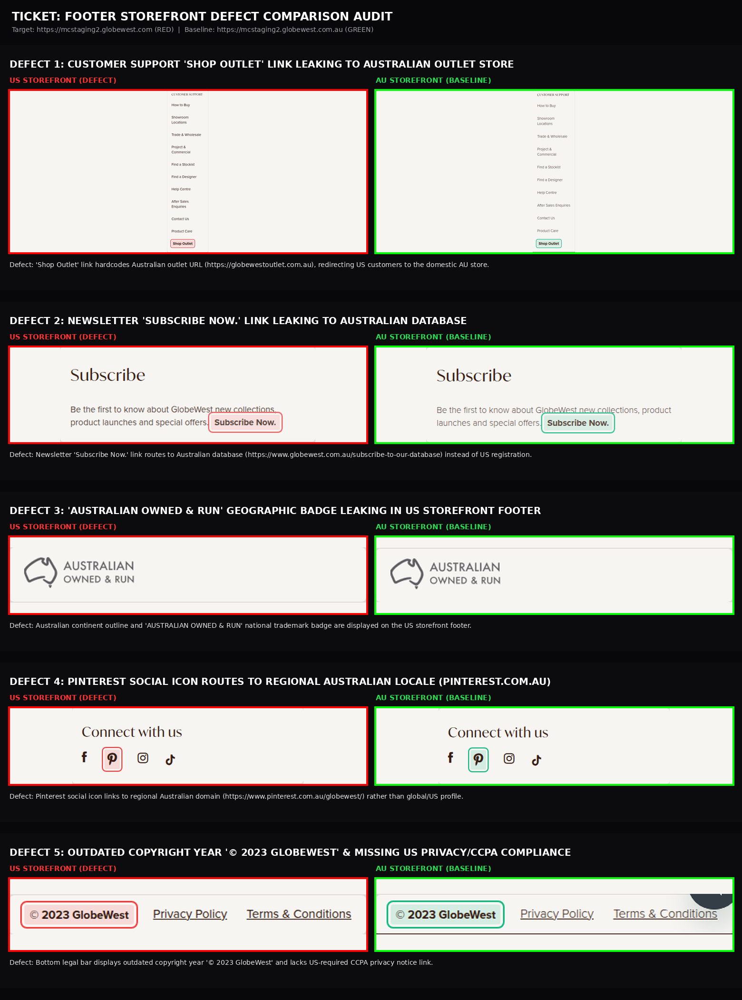
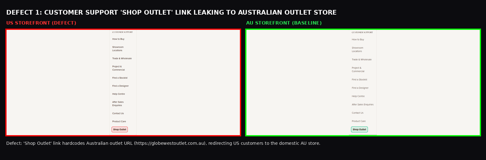
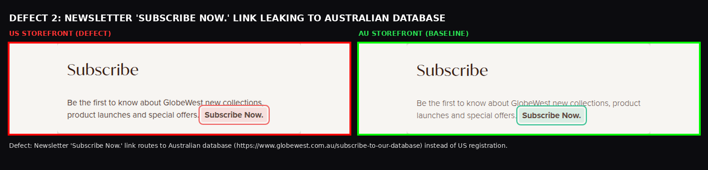
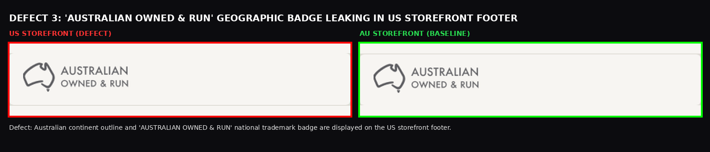
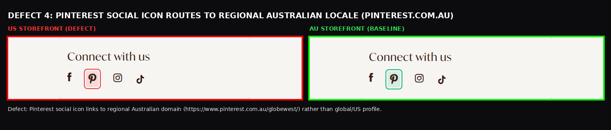
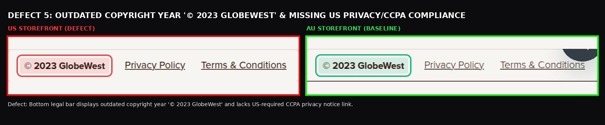

# QA Defect Comparison Report: US vs AU Storefront Footer

| Audit Scope | Details |
|---|---|
| **Ticket Reference** | Footer Storefront Parity & Defect Audit (Match AU) |
| **Target Storefront** | `https://mcstaging2.globewest.com` (US Storefront - RED) |
| **Baseline Storefront** | `https://mcstaging2.globewest.com.au` (AU Storefront - GREEN) |
| **Color Coding** | **RED** = US Storefront Defect \| **GREEN** = AU Storefront Baseline |
| **Comparison Folder** | `Footer/comparison/` |
| **Interactive HTML Gallery** | [VIEW_DEFECT_IMAGES.html](file:///home/deepali/My%20Projects/Deepali/GlobeWest%202026%20%282%29/Footer/VIEW_DEFECT_IMAGES.html) |
| **Test Cases (Excel)** | [Footer_TestCases.xlsx](file:///home/deepali/My%20Projects/Deepali/GlobeWest%202026%20%282%29/Footer/Footer_TestCases.xlsx) |
| **Test Cases (CSV)** | [Footer_TestCases.csv](file:///home/deepali/My%20Projects/Deepali/GlobeWest%202026%20%282%29/Footer/Footer_TestCases.csv) |

---

## One Combined Comparison Image (All Verified Defects)

A unified vertical comparison poster presenting all 5 verified Footer defects side-by-side:

- 📂 **Click to open file in IDE:** [ONE_COMBINED_FOOTER_DEFECTS_COMPARISON.png](file:///home/deepali/My%20Projects/Deepali/GlobeWest%202026%20%282%29/Footer/comparison/ONE_COMBINED_FOOTER_DEFECTS_COMPARISON.png)
- 📍 **Full Path:** `/home/deepali/My Projects/Deepali/GlobeWest 2026 (2)/Footer/comparison/ONE_COMBINED_FOOTER_DEFECTS_COMPARISON.png`

---

## Defect 1: Customer Support "Shop Outlet" Link Leaking to Australian Outlet Store

- 📂 **Click to open file in IDE:** [DEFECT_1_SHOP_OUTLET_AU_LEAK.png](file:///home/deepali/My%20Projects/Deepali/GlobeWest%202026%20%282%29/Footer/comparison/DEFECT_1_SHOP_OUTLET_AU_LEAK.png)
- 📍 **Full Path:** `/home/deepali/My Projects/Deepali/GlobeWest 2026 (2)/Footer/comparison/DEFECT_1_SHOP_OUTLET_AU_LEAK.png`
- **US Storefront (RED):** The Customer Support column displays a hardcoded "Shop Outlet" link pointing to `https://globewestoutlet.com.au/`.
- **AU Storefront (GREEN):** Routes Australian customers to their domestic secondary outlet inventory.
- **Defect Description:** "Shop Outlet" footer link hardcodes `https://globewestoutlet.com.au`, redirecting US customers to the Australian store with AUD pricing.

---

## Defect 2: Newsletter "Subscribe Now." Link Leaking to Australian Database

- 📂 **Click to open file in IDE:** [DEFECT_2_NEWSLETTER_SUBSCRIBE_AU_LEAK.png](file:///home/deepali/My%20Projects/Deepali/GlobeWest 2026 (2)/Footer/comparison/DEFECT_2_NEWSLETTER_SUBSCRIBE_AU_LEAK.png)
- 📍 **Full Path:** `/home/deepali/My Projects/Deepali/GlobeWest 2026 (2)/Footer/comparison/DEFECT_2_NEWSLETTER_SUBSCRIBE_AU_LEAK.png`
- **US Storefront (RED):** The Newsletter subscription CTA link hardcodes `https://www.globewest.com.au/subscribe-to-our-database`.
- **AU Storefront (GREEN):** Subscribes domestic Australian trade users to the Australian marketing database.
- **Defect Description:** Newsletter "Subscribe Now." link routes to Australian database (`https://www.globewest.com.au/subscribe-to-our-database`) instead of US customer registration.

---

## Defect 3: "Australian Owned & Run" Geographic Badge Leaking in US Footer

- 📂 **Click to open file in IDE:** [DEFECT_3_AUSTRALIAN_OWNED_BADGE_LEAK.png](file:///home/deepali/My%20Projects/Deepali/GlobeWest 2026 (2)/Footer/comparison/DEFECT_3_AUSTRALIAN_OWNED_BADGE_LEAK.png)
- 📍 **Full Path:** `/home/deepali/My Projects/Deepali/GlobeWest 2026 (2)/Footer/comparison/DEFECT_3_AUSTRALIAN_OWNED_BADGE_LEAK.png`
- **US Storefront (RED):** Displays the Australian continent map outline and "AUSTRALIAN OWNED & RUN" domestic emblem image (`design-logo-footer.png`).
- **AU Storefront (GREEN):** Expected domestic branding emblem for Australian consumers.
- **Defect Description:** Australian continent outline and "AUSTRALIAN OWNED & RUN" national trademark badge are displayed on the US storefront footer.

---

## Defect 4: Pinterest Social Icon Routes to Regional Australian Locale (pinterest.com.au)

- 📂 **Click to open file in IDE:** [DEFECT_4_PINTEREST_AU_LOCALE_LEAK.png](file:///home/deepali/My%20Projects/Deepali/GlobeWest 2026 (2)/Footer/comparison/DEFECT_4_PINTEREST_AU_LOCALE_LEAK.png)
- 📍 **Full Path:** `/home/deepali/My Projects/Deepali/GlobeWest 2026 (2)/Footer/comparison/DEFECT_4_PINTEREST_AU_LOCALE_LEAK.png`
- **US Storefront (RED):** The Pinterest social media icon in Column 1 links to `https://www.pinterest.com.au/globewest/`.
- **AU Storefront (GREEN):** Standard Australian Pinterest locale link.
- **Defect Description:** Pinterest social icon links to regional Australian domain (`https://www.pinterest.com.au/globewest/`) rather than global/US profile.

---

## Defect 5: Outdated Copyright Year "© 2023 GlobeWest" & Missing US Privacy/CCPA Compliance

- 📂 **Click to open file in IDE:** [DEFECT_5_OUTDATED_COPYRIGHT_2023.png](file:///home/deepali/My%20Projects/Deepali/GlobeWest 2026 (2)/Footer/comparison/DEFECT_5_OUTDATED_COPYRIGHT_2023.png)
- 📍 **Full Path:** `/home/deepali/My Projects/Deepali/GlobeWest 2026 (2)/Footer/comparison/DEFECT_5_OUTDATED_COPYRIGHT_2023.png`
- **US Storefront (RED):** Bottom legal bar displays static outdated year `© 2023 GlobeWest` and lacks a US-required CCPA / "Do Not Sell My Info" link.
- **AU Storefront (GREEN):** Displays `© 2023 GlobeWest Privacy Policy Terms & Conditions`.
- **Defect Description:** Bottom legal bar displays outdated copyright year "© 2023 GlobeWest" and lacks US-required CCPA privacy notice link.
