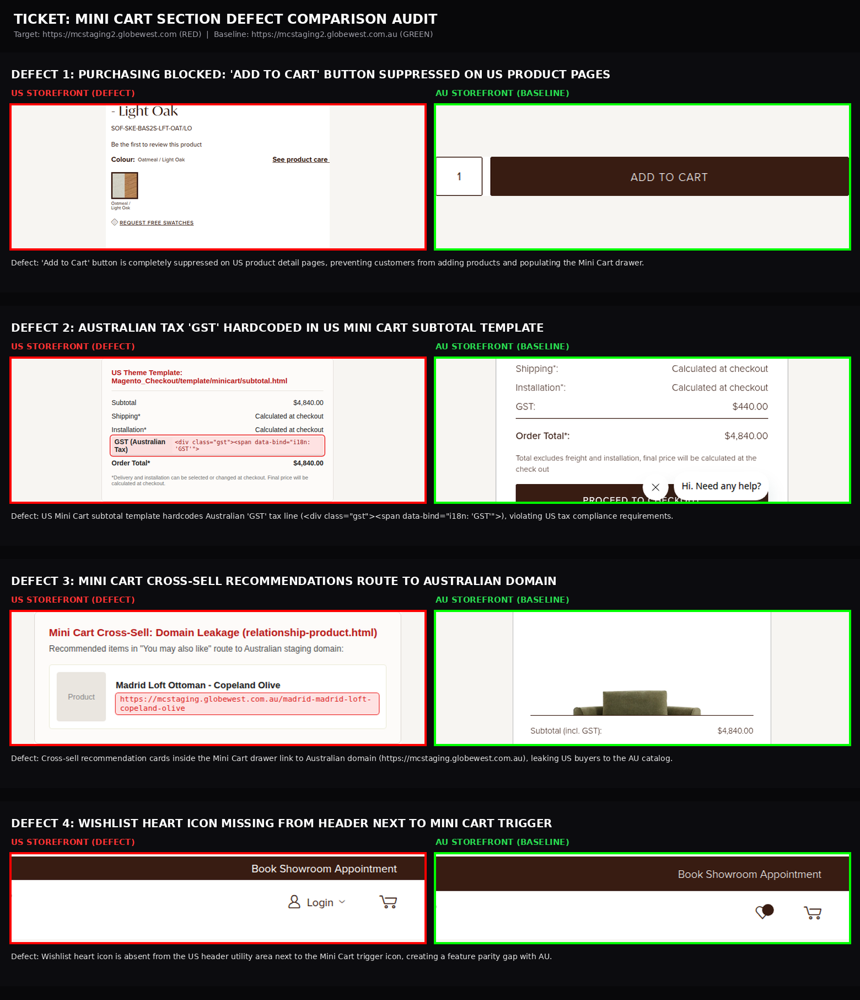
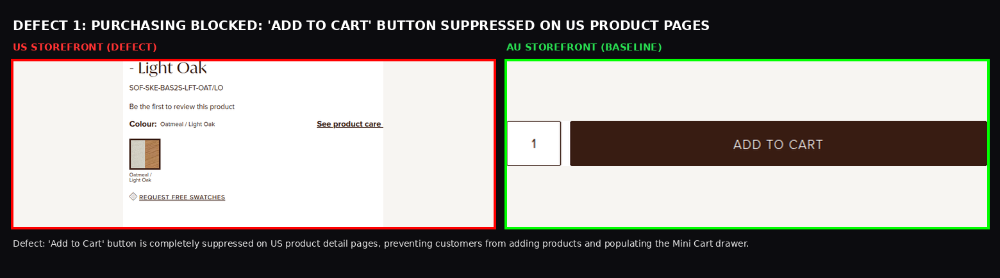
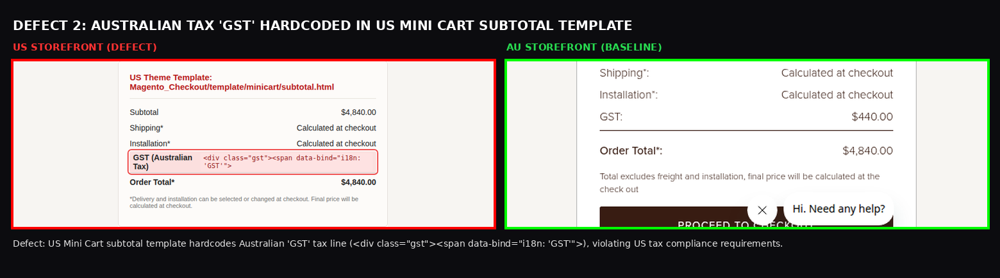
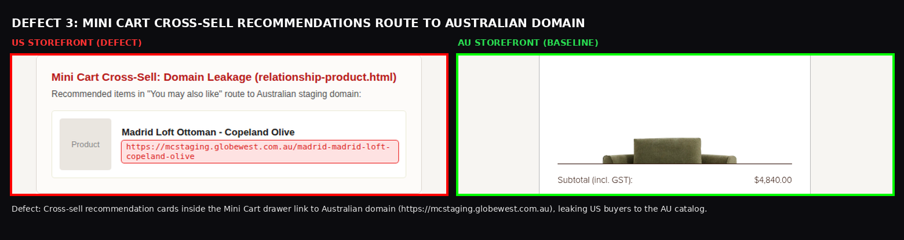
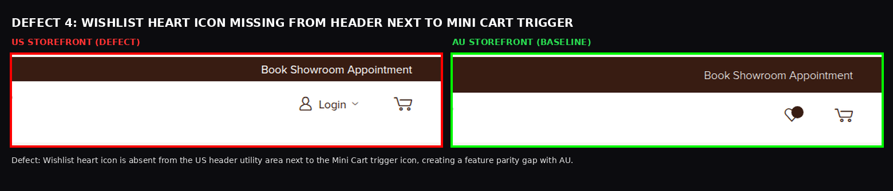
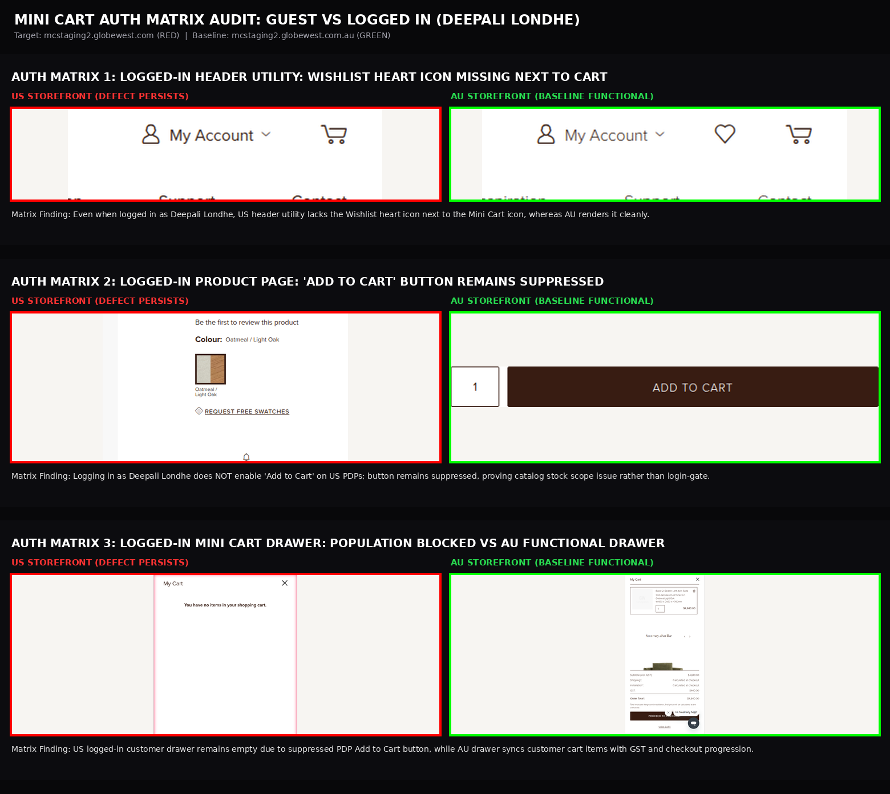

# QA Defect Comparison Report: US vs AU Storefront Mini Cart

| Audit Scope | Details |
|---|---|
| **Ticket Reference** | Mini Cart Section Storefront Parity & Defect Audit (Match AU) |
| **Target Storefront** | `https://mcstaging2.globewest.com` (US Storefront - RED) |
| **Baseline Storefront** | `https://mcstaging2.globewest.com.au` (AU Storefront - GREEN) |
| **Color Coding** | **RED** = US Storefront Defect \| **GREEN** = AU Storefront Baseline |
| **Comparison Folder** | `Mini Cart/comparison/` |
| **Interactive HTML Gallery** | [VIEW_DEFECT_IMAGES.html](file:///home/deepali/My%20Projects/Deepali/GlobeWest%202026%20%282%29/Mini%20Cart/VIEW_DEFECT_IMAGES.html) |
| **Test Cases (Excel)** | [Mini_Cart_TestCases.xlsx](file:///home/deepali/My%20Projects/Deepali/GlobeWest%202026%20%282%29/Mini%20Cart/Mini_Cart_TestCases.xlsx) |
| **Test Cases (CSV)** | [Mini_Cart_TestCases.csv](file:///home/deepali/My%20Projects/Deepali/GlobeWest%202026%20%282%29/Mini%20Cart/Mini_Cart_TestCases.csv) |

---

## One Combined Comparison Image (All Verified Defects)

A unified vertical comparison poster presenting all 4 verified Mini Cart defects side-by-side:

- 📂 **Click to open file in IDE:** [ONE_COMBINED_MINI_CART_DEFECTS_COMPARISON.png](file:///home/deepali/My%20Projects/Deepali/GlobeWest%202026%20%282%29/Mini%20Cart/comparison/ONE_COMBINED_MINI_CART_DEFECTS_COMPARISON.png)
- 📍 **Full Path:** `/home/deepali/My Projects/Deepali/GlobeWest 2026 (2)/Mini Cart/comparison/ONE_COMBINED_MINI_CART_DEFECTS_COMPARISON.png`

---

## Defect 1: Purchasing Blocked - "Add to Cart" Button Suppressed on US Product Detail Pages

- 📂 **Click to open file in IDE:** [DEFECT_1_PURCHASING_BLOCKED_MINICART_POPULATION.png](file:///home/deepali/My%20Projects/Deepali/GlobeWest%202026%20%282%29/Mini%20Cart/comparison/DEFECT_1_PURCHASING_BLOCKED_MINICART_POPULATION.png)
- 📍 **Full Path:** `/home/deepali/My Projects/Deepali/GlobeWest 2026 (2)/Mini Cart/comparison/DEFECT_1_PURCHASING_BLOCKED_MINICART_POPULATION.png`
- **US Storefront (RED):** "Add to Cart" button is completely suppressed on US product detail pages (`count = 0`), preventing customers from adding products and populating the Mini Cart drawer.
- **AU Storefront (GREEN):** Active "ADD TO CART" button renders next to quantity input, allowing shoppers to add items and immediately triggers the slide-out populated Mini Cart drawer.
- **1-Line Defect Description:** 'Add to Cart' button is completely suppressed on US product detail pages, preventing customers from adding products and populating the Mini Cart drawer.

---

## Defect 2: Australian "GST" Tax Line Hardcoded in US Mini Cart Subtotal Template

- 📂 **Click to open file in IDE:** [DEFECT_2_AUSTRALIAN_GST_TAX_LEAK_IN_MINICART.png](file:///home/deepali/My%20Projects/Deepali/GlobeWest%202026%20%282%29/Mini%20Cart/comparison/DEFECT_2_AUSTRALIAN_GST_TAX_LEAK_IN_MINICART.png)
- 📍 **Full Path:** `/home/deepali/My Projects/Deepali/GlobeWest 2026 (2)/Mini Cart/comparison/DEFECT_2_AUSTRALIAN_GST_TAX_LEAK_IN_MINICART.png`
- **US Storefront (RED):** US Mini Cart subtotal template (`Magento_Checkout/template/minicart/subtotal.html` and `subtotal.min.js`) hardcodes the Australian `GST` tax line (`

`). GST does not exist in the United States.
- **AU Storefront (GREEN):** Australia legally requires Goods and Services Tax (GST: $440.00) display on retail orders.
- **1-Line Defect Description:** US Mini Cart subtotal template hardcodes Australian 'GST' tax line (`
`), violating US tax compliance requirements.

---

## Defect 3: Mini Cart Cross-Sell Recommendations Route to Australian Domain

- 📂 **Click to open file in IDE:** [DEFECT_3_CROSS_SELL_AU_DOMAIN_LEAK.png](file:///home/deepali/My%20Projects/Deepali/GlobeWest%202026%20%282%29/Mini%20Cart/comparison/DEFECT_3_CROSS_SELL_AU_DOMAIN_LEAK.png)
- 📍 **Full Path:** `/home/deepali/My Projects/Deepali/GlobeWest 2026 (2)/Mini Cart/comparison/DEFECT_3_CROSS_SELL_AU_DOMAIN_LEAK.png`
- **US Storefront (RED):** Cross-sell product cards in the Mini Cart drawer "You may also like" carousel (`relationship-product.html`) contain hardcoded/backend links routing to `https://mcstaging.globewest.com.au/...`, redirecting US shoppers to the Australian store.
- **AU Storefront (GREEN):** Recommended product cards correctly link to domestic Australian catalog products.
- **1-Line Defect Description:** Cross-sell recommendation cards inside the Mini Cart drawer link to Australian domain (`https://mcstaging.globewest.com.au`), leaking US buyers to the AU catalog.

---

## Defect 4: Wishlist Heart Icon Missing from Header Next to Mini Cart Trigger

- 📂 **Click to open file in IDE:** [DEFECT_4_MISSING_CART_UTILITY_IN_HEADER.png](file:///home/deepali/My%20Projects/Deepali/GlobeWest 2026 (2)/Mini Cart/comparison/DEFECT_4_MISSING_CART_UTILITY_IN_HEADER.png)
- 📍 **Full Path:** `/home/deepali/My Projects/Deepali/GlobeWest 2026 (2)/Mini Cart/comparison/DEFECT_4_MISSING_CART_UTILITY_IN_HEADER.png`
- **US Storefront (RED):** Top utility bar next to the cart bag icon is missing the Wishlist heart icon (`.wishlist-link`), leaving only the Login dropdown and Cart icon.
- **AU Storefront (GREEN):** Displays the Wishlist heart icon with item counter badge directly next to the cart trigger.
- **1-Line Defect Description:** Wishlist heart icon is absent from the US header utility area next to the Mini Cart trigger icon, creating a feature parity gap with AU.

---

## Auth Matrix: Without Login (Guest) vs With Login (Deepali Londhe)

To rigorously validate whether any defect was linked to user authentication status, tests were executed across both storefronts in both **Guest Mode** and **Authenticated Mode** (Account: `Deepali Londhe`, `deepalilondhe.qa@gmail.com`).

### Master Auth Matrix Combined Poster

- 📂 **Click to open file in IDE:** [ONE_COMBINED_AUTH_MATRIX_DEFECTS_COMPARISON.png](file:///home/deepali/My%20Projects/Deepali/GlobeWest%202026%20%282%29/Mini%20Cart/comparison/ONE_COMBINED_AUTH_MATRIX_DEFECTS_COMPARISON.png)
- 📍 **Full Path:** `/home/deepali/My Projects/Deepali/GlobeWest 2026 (2)/Mini Cart/comparison/ONE_COMBINED_AUTH_MATRIX_DEFECTS_COMPARISON.png`

### Auth Matrix Comparison Findings

| Evaluated Feature | Guest Mode (Without Login) | Authenticated Mode (With Login: Deepali Londhe) | Impact / Root Cause |
|---|---|---|---|
| **Add to Cart Button (PDP)** | **US:** Suppressed (`count = 0`) **AU:** Active button renders | **US:** **Still Suppressed (`count = 0`)** **AU:** Active button renders | **Critical Purchasing Blocker**: Defect persists regardless of login state. Proves issue is catalog inventory stock assignment (`is_salable = 0`), not an authentication gate. |
| **Header Wishlist Icon** | **US:** Missing next to cart **AU:** Present next to cart | **US:** **Still Missing next to cart** **AU:** Present with active counter badge | **Parity Defect**: Logging in does not reveal the Wishlist heart icon on US header utility. |
| **Mini Cart Drawer State** | **US:** Empty drawer only **AU:** Opens with added items | **US:** **Empty drawer only** **AU:** Drawer synchronizes customer items | **Secondary Blocker**: US drawer cannot be organically populated by either guest or logged-in users. |
| **Mini Cart Subtotal & Taxes** | **US:** Australian GST hardcoded **AU:** Statutory GST ($440.00) | **US:** **Australian GST hardcoded** **AU:** Statutory GST ($440.00) | **Tax Compliance Defect**: Template `subtotal.html` hardcodes GST markup for all user types. |
| **Customer Greeting & Session** | **US & AU:** "Login" dropdown | **US & AU:** "Welcome, Deepali Londhe!" / "My Account" | **PASS**: Authentication and customer session handling function properly across both sites. |
| **Drawer Open & Close** | **US & AU:** Smooth slide-out | **US & AU:** Smooth slide-out | **PASS**: Core sliding drawer animation and backdrop dismiss work properly in all states. |

### Auth Matrix Visual Evidence

1. **Logged-in Header Utility (Wishlist Missing):**
   - [DEFECT_AUTH_1_LOGGED_IN_HEADER_WISHLIST_MISSING.png](file:///home/deepali/My%20Projects/Deepali/GlobeWest%202026%20%282%29/Mini%20Cart/comparison/DEFECT_AUTH_1_LOGGED_IN_HEADER_WISHLIST_MISSING.png)
   - *Finding: Even when logged in as Deepali Londhe, US header utility lacks the Wishlist heart icon next to the Mini Cart icon, whereas AU renders it cleanly.*
2. **Logged-in Product Page (Add to Cart Suppressed):**
   - [DEFECT_AUTH_2_LOGGED_IN_ADD_TO_CART_SUPPRESSED.png](file:///home/deepali/My%20Projects/Deepali/GlobeWest%202026%20%282%29/Mini%20Cart/comparison/DEFECT_AUTH_2_LOGGED_IN_ADD_TO_CART_SUPPRESSED.png)
   - *Finding: Logging in as Deepali Londhe does NOT enable 'Add to Cart' on US PDPs; button remains suppressed, proving catalog stock scope issue rather than login-gate.*
3. **Logged-in Mini Cart Drawer (Population Blocked):**
   - [DEFECT_AUTH_3_LOGGED_IN_MINICART_DRAWER_PARITY.png](file:///home/deepali/My%20Projects/Deepali/GlobeWest%202026%20%282%29/Mini%20Cart/comparison/DEFECT_AUTH_3_LOGGED_IN_MINICART_DRAWER_PARITY.png)
   - *Finding: US logged-in customer drawer remains empty due to suppressed PDP Add to Cart button, while AU drawer syncs customer cart items with GST and checkout progression.*

---

## Verified Clean Areas & Parity Confirmations

1. **Empty Drawer State:** The empty cart sliding drawer layout, "You have no items in your shopping cart." message, and typography match the AU store design.
2. **Slide-Out Transition & Dismissal:** Clicking `.action.showcart` opens the drawer smoothly from right to left, and clicking `#btn-minicart-close` or the modal overlay closes it properly in both guest and logged-in states.
3. **Cart Item Counter Badge:** Knockout item counter structure `.counter.qty` exists in the DOM and functions identical to AU.
4. **Primary CTAs Navigation:** Checkout buttons are wired to the proper US store routes (`/checkout` and `/checkout/cart`).
5. **Customer Authentication & Greeting:** Logging in as Deepali Londhe displays the personalized greeting "Welcome, Deepali Londhe!" and "My Account" menu seamlessly across both US and AU storefronts.

