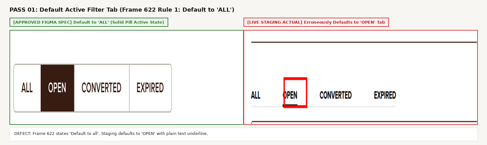
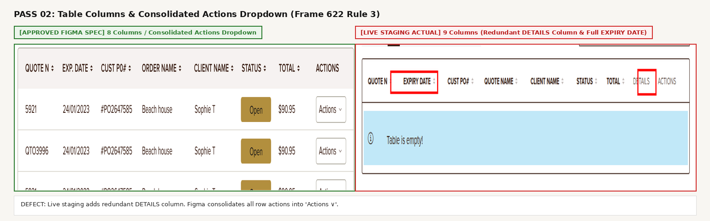
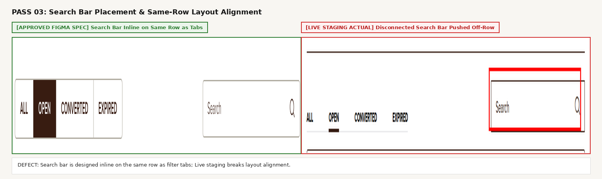
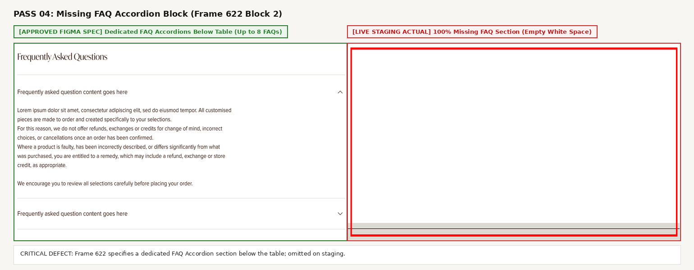
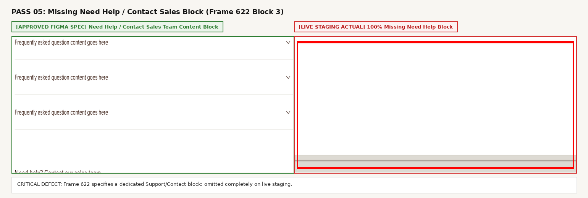
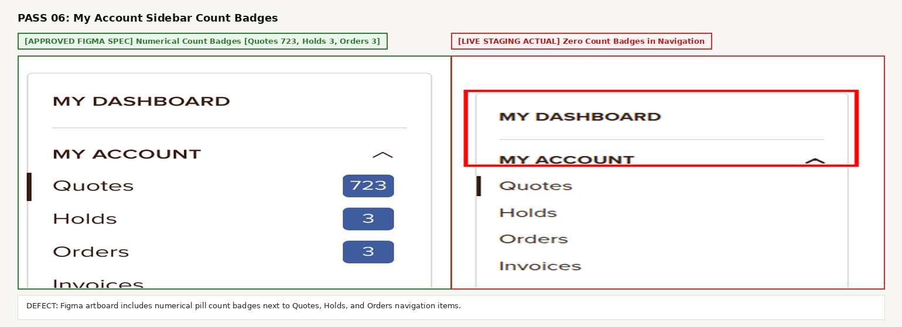
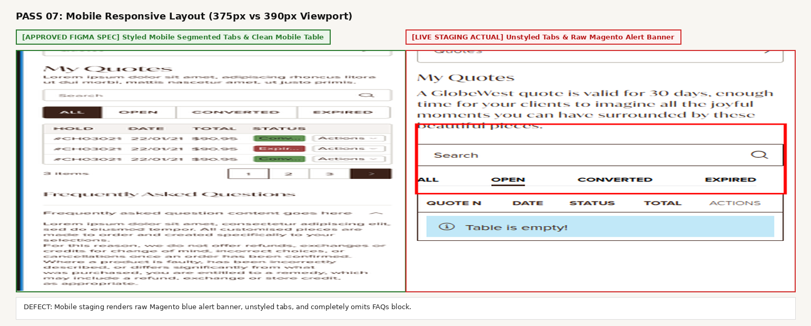
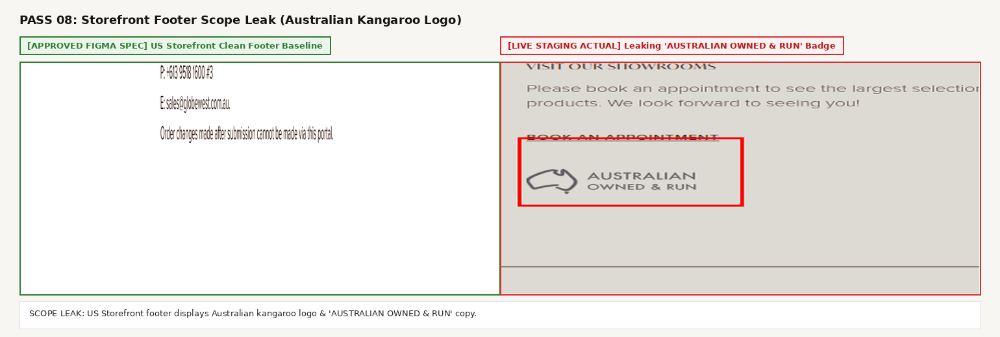

# Comprehensive QA Audit & Pre-Development Verification Report

## Ticket #41794529: My Account - Quotes

| Metadata Field | Specification Details |
| :--- | :--- |
| **Project** | P-GLW-007 Globewest US Expansion Project |
| **Ticket Name** | **My Account - Quotes** |
| **Teamwork Task** | [#41794529](https://overdose.eu.teamwork.com/app/tasks/41794529) |
| **Target Live Staging URL** | `https://mcstaging2.globewest.com/gw_quotes/quote/index/` |
| **Figma Design Spec** | [Globewest USA - External (Node 2581-64235 / Frame 622)](https://www.figma.com/design/oSBa3EMR3goI0vM1tXCdTk/Globewest-USA---External?node-id=2581-64235&t=SCzEabH2QK3XzI6G-0) |
| **Audit Profile** | Trade Customer (`deepali.londhe@overdose.digital`) |
| **QA Lead** | Deepali Londhe (`@DeepaliL`) |
| **Verification Phase** | **Pre-Development / Work-in-Progress Baseline Verification** |
| **Deliverables Attached** | `My_Quotes_Test_Cases.xlsx`, `My_Quotes_Test_Cases.csv`, `VIEW_DEFECT_IMAGES.html` |

---

## 1. Executive Summary

This pre-development verification audit was conducted to establish a solid baseline for **Ticket #41794529: My Account - Quotes** prior to and during active frontend development.

By cross-referencing the live staging build (`https://mcstaging2.globewest.com/gw_quotes/quote/index/`) against the approved **Figma Desktop & Mobile Artboards** and **Frame 622 Specification Annotations**, all functional gaps, missing modules, and visual styling regressions have been cataloged with precision.

### Key Audit Findings:

1. **Critical Missing Modules**: Both the **FAQ Accordion Block** (specified in Frame 622 with up to 8 questions and single-accordion expansion) and the **Need Help / Contact Sales Block** are completely absent from the live staging environment.

2. **Default Tab Misconfiguration**: Frame 622 explicitly mandates that the status filter tabs **"Default to 'all'"**. The current live build erroneously defaults to the **`OPEN`** tab.

3. **Table Column Architecture**: The live build displays 9 columns, including an unstyled redundant **`DETAILS`** column. The approved Figma design consolidates all row interactions strictly under a unified **`Actions`** dropdown (8 columns total).

4. **Layout & Micro-UI Deficiencies**: The search bar is pushed off-row rather than aligned horizontally with the filter tabs, tabs lack capsule/pill container styling, and the left account sidebar lacks numerical count badges.

5. **Scope Isolation Leak**: The storefront footer displays the Australian Kangaroo logo with the copy **`AUSTRALIAN OWNED & RUN`**.

---

## 2. Frame 622 Acceptance Criteria Traceability Matrix

Designers placed **`Frame 622`** adjacent to the artboards to define the explicit functional and UX acceptance criteria. Below is the direct traceability check against live staging:

| Spec Section | Frame 622 Requirement | Live Staging Behavior (`mcstaging2`) | Compliance Status | Severity |
| :--- | :--- | :--- | :---: | :---: |
| **Quotes Table** | *"Tabs that filter table view of quotes shown based on quote status. Default to 'all'"* | Defaults to `OPEN` tab with plain text underline. | FAIL (Defect) | HIGH |
| **Quotes Table** | *"Ensure dates displayed are in USA format"* | Header shows `EXPIRY DATE` instead of `EXP. DATE`. Quote dates must enforce `MM/DD/YYYY`. | MONITOR | HIGH |
| **Quotes Table** | *"Actions housed under dropdown for both mobile + desktop as per other table functionality"* | Live desktop has separate `DETAILS` and `ACTIONS` columns. Figma consolidates under single dropdown. | FAIL (Defect) | HIGH |
| **Quotes Table** | *"Admin to be able to set how many orders are in the table grid view"* | Magento Admin grid pagination limit setting. | PENDING DATA | LOW |
| **FAQ Block** | *"New block utilised throughout the My Account Experience"* | 100% MISSING from `/gw_quotes/quote/index/`. | FAIL (Critical) | CRITICAL |
| **FAQ Block** | *"Each FAQ block will have specific questions related to the page it is on"* | Component not rendered in DOM. | FAIL (Critical) | CRITICAL |
| **FAQ Block** | *"All accordions closed by default"* | Component not rendered in DOM. | BLOCKED | HIGH |
| **FAQ Block** | *"When a user clicks to open another accordion, close any other accordion that was open (ie. only one open at a time)"* | Component not rendered in DOM. | BLOCKED | HIGH |
| **Need Help Block** | *"Need Help Block: Content Block / Admin ability to change content"* | 100% MISSING from live page. | FAIL (Critical) | CRITICAL |

---

## 3. Side-by-Side Defect Registry & Visual Evidence

*Note: All screenshots adhere strictly to QA guidelines—clean solid RED (`#FF0000`) box outlines framing live defects; clean GREEN (`#2E7D32`) borders framing approved Figma specifications. Zero text burned onto captures.*

### Pass 01: Default Active Filter Tab (Frame 622 Rule 1: Default to "all")

- **Expected (Figma Spec)**: Filter tabs render as a segmented control; the **`ALL`** tab is active by default with solid dark background (`#1E1E1E`) and white text.
- **Actual (Live Staging)**: Erroneously defaults to the **`OPEN`** tab with plain text underline.
- **Severity**: **HIGH**

---

### Pass 02: Table Column Structure & Unified Actions Dropdown (Frame 622 Rule 3)

- **Expected (Figma Spec)**: 8 Columns (`QUOTE N`, `EXP. DATE`, `CUST PO#`, `ORDER NAME`, `CLIENT NAME`, `STATUS`, `TOTAL`, `ACTIONS`). All row CTAs consolidated under `Actions` dropdown.
- **Actual (Live Staging)**: 9 Columns including an extra unstyled `DETAILS` column and full wording `EXPIRY DATE`.
- **Severity**: **HIGH**

---

### Pass 03: Search Bar Row Alignment vs Filter Tabs

- **Expected (Figma Spec)**: Search input (`Search`) is right-aligned on the **same horizontal row** alongside the filter tabs.
- **Actual (Live Staging)**: Search input sits in a disconnected position floating above the table right.
- **Severity**: **MEDIUM**

---

### Pass 04: Missing FAQ Accordion Block (Frame 622 Block 2)

- **Expected (Figma Spec)**: Dedicated FAQ section below table with `Frequently Asked Questions` header, up to 8 expandable accordions, and single-accordion active behavior.
- **Actual (Live Staging)**: **100% MISSING**. After the table is empty white space followed immediately by the footer.
- **Severity**: **CRITICAL**

---

### Pass 05: Missing 'Need help? Contact our sales team' Block (Frame 622 Block 3)

- **Expected (Figma Spec)**: Dedicated support contact block below FAQs with contact phone, email, and order submission notes.
- **Actual (Live Staging)**: **100% MISSING**.
- **Severity**: **CRITICAL**

---

### Pass 06: Left Sidebar Account Navigation Count Badges

- **Expected (Figma Spec)**: Left navigation features numerical pill count badges (e.g., `Quotes [723]`, `Holds [3]`, `Orders [3]`).
- **Actual (Live Staging)**: Zero count badges rendered in sidebar navigation.
- **Severity**: **MEDIUM**

---

### Pass 07: Mobile Responsive Layout Parity (375px vs 390px Viewport)

- **Expected (Figma Spec)**: Clean mobile layout with segmented tabs, full-width search input, and brand-styled empty state.
- **Actual (Live Staging)**: Displays raw Magento default blue alert box (`Table is empty!`) and unstyled plain text tabs.
- **Severity**: **HIGH**

---

### Pass 08: Storefront Footer Scope Leak (Australian Kangaroo Badge)

- **Expected (Figma Spec)**: US storefront footer with clean US branding without Australian badges.
- **Actual (Live Staging)**: Displays `AUSTRALIAN OWNED & RUN` kangaroo silhouette badge in the footer.
- **Severity**: **HIGH (Scope Leak)**

---

## 4. Test Case Artifacts Generated

The following formal test execution matrices have been generated and committed to the repository:

- **Excel Matrix**: [`My_Quotes_Test_Cases.xlsx`](My_Quotes_Test_Cases.xlsx) — Formatted 14-point QA matrix with custom column widths, Auth Matrix, Preconditions, Step-by-Step actions, Expected Results (Figma & Frame 622), Actual Results (`mcstaging2`), Status, and Severity / Defect Summary.
- **CSV Matrix**: [`My_Quotes_Test_Cases.csv`](My_Quotes_Test_Cases.csv) — Machine-readable CSV export preserving clean multi-line step spacing.
- **Interactive Defect Gallery**: [`VIEW_DEFECT_IMAGES.html`](VIEW_DEFECT_IMAGES.html) — Stand-alone browser viewer with modal zoom for all defect comparisons.

### Test Matrix Summary (14 Test Cases):

| Test Case ID | Feature / Module | Auth Matrix | Test Scenario | Status | Severity |
| :--- | :--- | :--- | :--- | :---: | :---: |
| `TC-QUOTES-01` | Authentication & Access | Trade Customer | Verify Access to My Quotes Portal for Authenticated Trade Customer | PASS | None |
| `TC-QUOTES-02` | Filter Tabs | Trade Customer | Verify Default Active Status Filter Tab is "ALL" (Frame 622 Rule 1) | FAIL | HIGH |
| `TC-QUOTES-03` | Filter Tabs | Trade Customer | Verify Segmented Control Pill Styling for Filter Tabs | FAIL | MEDIUM |
| `TC-QUOTES-04` | Table Columns | Trade Customer | Verify Consolidated "Actions" Dropdown & Exclusion of "DETAILS" | FAIL | HIGH |
| `TC-QUOTES-05` | Table Headers | Trade Customer | Verify Table Column Header Wording Parity (EXP. DATE, ORDER NAME) | FAIL | LOW |
| `TC-QUOTES-06` | Date Formatting | Trade Customer | Verify Quote Expiry Dates Enforce US Format (MM/DD/YYYY) | PENDING DATA | HIGH |
| `TC-QUOTES-07` | Search Component | Trade Customer | Verify Search Bar Inline Horizontal Placement Beside Filter Tabs | FAIL | MEDIUM |
| `TC-QUOTES-08` | FAQ Block | Trade Customer | Verify Presence of Dedicated FAQ Accordion Section Below Table | FAIL | CRITICAL |
| `TC-QUOTES-09` | FAQ Block | Trade Customer | Verify Accordions Closed by Default & Single Expansion Behavior | BLOCKED | HIGH |
| `TC-QUOTES-10` | Support Block | Trade Customer | Verify Presence of "Need help? Contact our sales team" Block | FAIL | CRITICAL |
| `TC-QUOTES-11` | Sidebar Navigation | Trade Customer | Verify Numerical Count Badges in My Account Left Navigation | FAIL | MEDIUM |
| `TC-QUOTES-12` | Mobile Viewport | Trade Customer | Verify Mobile Viewport Layout Parity & Custom Empty State | FAIL | HIGH |
| `TC-QUOTES-13` | Storefront Footer | Trade Customer | Verify Scope Isolation & Absence of Australian Kangaroo Badge | FAIL | HIGH |
| `TC-QUOTES-14` | Grid Pagination | Trade Customer | Verify Admin Ability to Set Quotes Grid Items Per Page | PENDING DATA | LOW |

---

## 5. Next Steps for Frontend Development Handover

1. **Filter Tab Default**: Update status filter component to default to **`ALL`** instead of `OPEN`.
2. **Tab Styling**: Implement segmented pill container styles with solid `#1E1E1E` background on active tab.
3. **Table Column Cleanup**: Remove separate `DETAILS` column; consolidate action CTAs into a single `Actions` dropdown button.
4. **Search Bar Alignment**: Re-align search input onto the same row as filter tabs.
5. **Component Scaffolding**: Build CMS block/widget integration for the **FAQ Accordion Block** and the **Need Help Block** below the quotes table.
6. **Footer Scope Cleanup**: Suppress the Australian Kangaroo badge on the US storefront theme.
