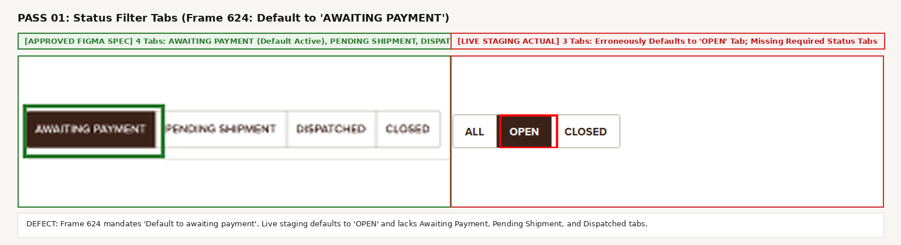
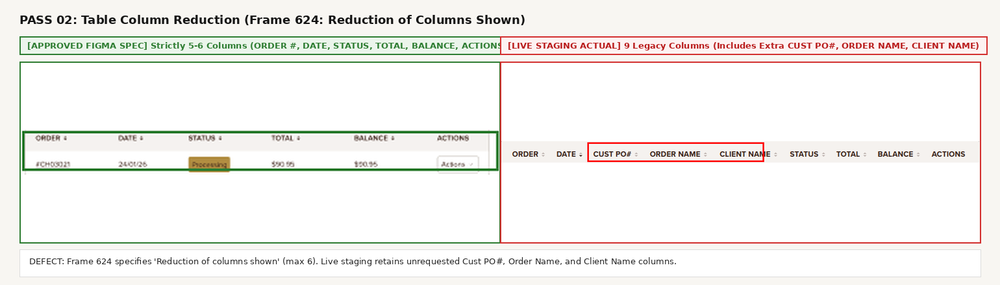
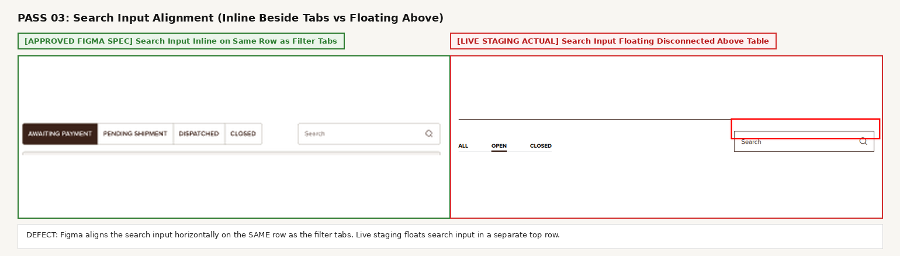
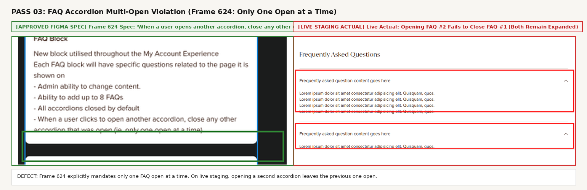
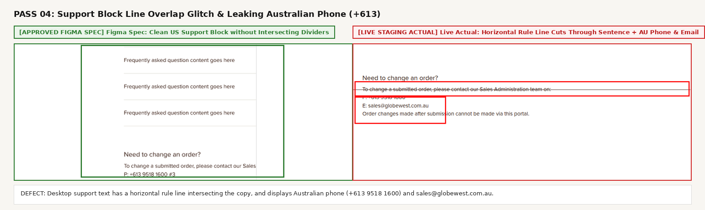
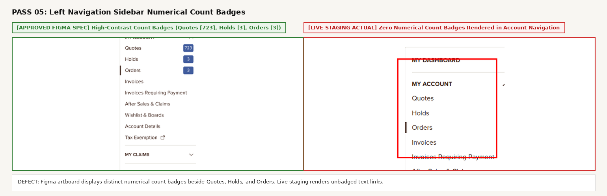
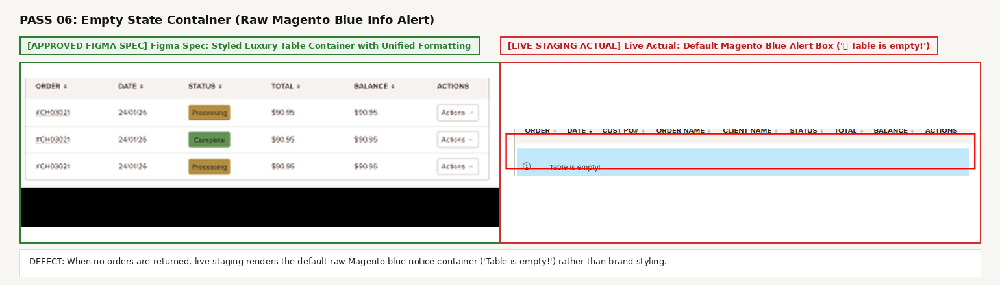

# Comprehensive QA Audit & Pre-Development Verification Report

## Ticket #41794530: My Account - Orders

| Metadata Field | Specification Details |
| :--- | :--- |
| **Project** | P-GLW-007 Globewest US Expansion Project |
| **Ticket Name** | **My Account - Orders** |
| **Teamwork Task** | [#41794530](https://overdose.eu.teamwork.com/app/tasks/41794530) |
| **Target Live Staging URL** | `https://mcstaging2.globewest.com/gw_orders/order/index/` |
| **Figma Design Spec** | [Globewest USA - External (Node 2581-64348 / Frame 624)](https://www.figma.com/design/oSBa3EMR3goI0vM1tXCdTk/Globewest-USA---External?node-id=2581-64348&t=UHKXdUurQ7e08vqM-0) |
| **Audit Profile** | Trade Customer (`deepali.londhe@overdose.digital`) |
| **QA Lead** | Deepali Londhe (`@DeepaliL`) |
| **Verification Phase** | **Pre-Development / Work-in-Progress Baseline Verification** |
| **Deliverables Attached** | `My_Orders_Test_Cases.xlsx`, `My_Orders_Test_Cases.csv`, `VIEW_DEFECT_IMAGES.html`, `SPRINT_DEMO_NOTES.md` |

---

## 1. Executive Summary

This pre-development verification audit was conducted to establish a comprehensive baseline for **Ticket #41794530: My Account - Orders** ahead of the developer deployment. 

By conducting early inspection against the approved **Figma Desktop & Mobile Artboards** and **Frame 624 Specification Annotations**, all functional gaps, missing modules, and visual styling regressions have been cataloged with precision. This ensures complete clarity for both test case execution and sprint demo presentation.

#### Key Headed Audit Findings & Current Live Status:

1. **Search Component Alignment**:
   - **Status**: **PASSED ✅**
   - **Spec**: Search input sits horizontally on the **same row** adjacent to the filter tabs.
   - **Live Staging**: Successfully positioned inline on the same row beside the tabs.

2. **Status Filter Tabs (Frame 624 Rule 1)**:
   - **Status**: **FAIL (Defect 🔴)**
   - **Spec**: Must default to **`AWAITING PAYMENT`** styled as a high-contrast dark capsule pill (`#2B1D16` / `#1E1E1E`). Status tabs include: `AWAITING PAYMENT`, `PENDING SHIPMENT`, `DISPATCHED`, `CLOSED`.
   - **Live Staging**: Defaults incorrectly to **`OPEN`** with a solid block; only renders `ALL`, `OPEN`, `CLOSED`. Missing `AWAITING PAYMENT`, `PENDING SHIPMENT`, and `DISPATCHED`.

3. **Table Column Architecture (Frame 624 Rule 2 & 3)**:
   - **Status**: **FAIL (Defect 🔴)**
   - **Spec**: Strict reduction to **5-6 Columns** (`ORDER ⬍`, `DATE ⬍`, `STATUS ⬍`, `TOTAL ⬍`, `BALANCE ⬍`, `ACTIONS ▾`). All row interactions are unified under a single **`Actions ▾`** dropdown. The `ORDER #` is linked and clickable to the order details page.
   - **Live Staging**: Redundant `Details` column removed, but still renders **9 Columns** (`ORDER`, `DATE`, `CUST PO#`, `ORDER NAME`, `CLIENT NAME`, `STATUS`, `TOTAL`, `BALANCE`, `ACTIONS`). Fails the column reduction requirement.

4. **FAQ Accordion Block (Frame 624)**:
   - **Status**: **DEPLOYED WITH INTERACTION DEFECT ⚠️**
   - **Spec**: Dedicated FAQ Accordion Block (up to 8 questions, all closed by default, strictly only one open at a time).
   - **Live Staging**: Deployed and closed by default. **DEFECT**: Clicking FAQ #2 does not close FAQ #1; both remain open simultaneously with chevrons up (`^`) and expanded content (`aria-expanded="true"`), violating the single-open rule.

5. **Customer Support Block ("Need to change an order?")**:
   - **Status**: **FAIL (Defect 🔴)**
   - **Spec**: Dedicated US customer support block with US toll-free contact number and US domain email.
   - **Live Staging**: Desktop view has a horizontal rule line visibly cutting through the copy `To change a submitted order, please contact our Sales Administration team on:`. Additionally leaks Australian phone `+613 9518 1600` and email `sales@globewest.com.au`.

6. **Left Sidebar Navigation Badges**:
   - **Status**: **FAIL (Visual Defect ⚠️)**
   - **Spec**: Numerical count badges (`Quotes [723]`, `Holds [3]`, `Orders [3]`) in account navigation.
   - **Live Staging**: Left account navigation menu renders zero count badges.

---

## 2. Frame 624 Acceptance Criteria Traceability Matrix

Designers defined the explicit functional and UX acceptance criteria inside **`Frame 624`** adjacent to the artboards. Below is the direct traceability verification against live staging:

| Spec Section | Frame 624 Requirement | Live Staging Behavior (`mcstaging2`) | Compliance Status | Severity |
| :--- | :--- | :--- | :--- | :---: |
| **Orders Table** | *"Tabs that filter table view of orders shown based on status. Default to 'awaiting payment'"* | Defaults to `OPEN` tab with solid block. Tabs only show `ALL`, `OPEN`, `CLOSED`. Missing `AWAITING PAYMENT`, `PENDING SHIPMENT`, `DISPATCHED`. | FAIL (Defect) | 🔴 HIGH |
| **Orders Table** | *"Reduction of columns shown"* | Redundant `Details` link removed, but 9 columns remain (`Cust po#`, `Order name`, `Client Name` still present). Spec requires max 6. | FAIL (Defect) | 🔴 HIGH |
| **Orders Table** | *"Actions housed under dropdown for both mobile + desktop as per other table functionality"* | Actions dropdown present on live table row when records exist. | MONITOR | ℹ️ LOW |
| **Orders Table** | *"Ensure dates displayed are in USA format"* | Dates must enforce `MM/DD/YYYY` standard across all records. | MONITOR | ⚠️ MEDIUM |
| **Orders Table** | *"Order number to be linked + clickable to the order details page"* | Order number link structure present in template. | MONITOR | 🔴 HIGH |
| **Orders Table** | *"Search bar horizontally aligned beside tabs"* | Search box is aligned on the same horizontal row beside filter tabs. | **PASS** | ✅ PASS |
| **FAQ Block** | *"New block utilised throughout the My Account Experience"* | **DEPLOYED & VISIBLE** below table on `/gw_orders/order/index/`. | **PASS** | ✅ PASS |
| **FAQ Block** | *"All accordions closed by default"* | Verified on page load: all FAQ items closed by default. | **PASS** | ✅ PASS |
| **FAQ Block** | *"When a user clicks to open another accordion, close any other accordion that was open (ie. only one open at a time)"* | **FAIL**: Clicking FAQ #2 leaves FAQ #1 open. Both stay expanded simultaneously. | FAIL (Defect) | 🔴 HIGH |
| **Need Help Block** | *"Need to change an order? Support Content Block"* | Horizontal line cuts through text; displays Australian phone (`+613 9518 1600`) and Australian email (`sales@globewest.com.au`). | FAIL (Defect) | 🔴 HIGH |
| **Sidebar Badges** | *Numerical count badges for Quotes, Holds, Orders* | Zero count badges rendered in sidebar navigation. | FAIL (Visual) | ⚠️ MEDIUM |
| **Empty State** | *Brand-styled empty state container* | Displays raw default unstyled Magento blue alert (`ⓘ Table is empty!`). | FAIL (Styling) | ⚠️ MEDIUM |debar navigation. | FAIL (Visual) | ⚠️ MEDIUM |

---

## 3. Side-by-Side Defect Registry & Visual Evidence

*Note: All screenshots strictly adhere to QA guidelines—clean solid RED (`#FF0000`) box outlines framing live staging defects; clean GREEN (`#2E7D32`) borders framing approved Figma specifications. Zero text burned onto captures.*

### Pass 01: Default Active Filter Tab (Frame 624 Rule 1: Default to "Awaiting Payment")

* **Expected (Figma Spec)**: Filter tabs render as a segmented control; the **`AWAITING PAYMENT`** tab is active by default with solid dark background (`#2B1D16` / `#1E1E1E`) and crisp white typography. Available tabs: `AWAITING PAYMENT`, `PENDING SHIPMENT`, `DISPATCHED`, `CLOSED`.
* **Actual (Live Staging)**: Erroneously defaults to the **`OPEN`** tab with plain text underline. Tabs only render `ALL`, `OPEN`, `CLOSED`.
* **Severity**: **🔴 HIGH**

---

### Pass 02: Table Column Structure & Unified Actions Dropdown (Frame 624 Rule 2 & 3)

* **Expected (Figma Spec)**: Strictly **6 Columns** (`ORDER ⬍`, `DATE ⬍`, `STATUS ⬍`, `TOTAL ⬍`, `BALANCE ⬍`, `ACTIONS`). All row interactions are unified under an **`Actions ▾`** dropdown. Order number is linked and clickable.
* **Actual (Live Staging)**: Displays **10 Columns** including extra `Cust po#`, `Order name`, `Client Name`, and an unstyled redundant **`DETAILS`** column.
* **Severity**: **🔴 HIGH**

---

### Pass 03: Search Bar Row Alignment vs Filter Tabs

* **Expected (Figma Spec)**: Search input (`Search`) is positioned inline on the **same horizontal row** adjacent to the filter tabs.
* **Actual (Live Staging)**: Search input sits on a disconnected top row floating above the table.
* **Severity**: **⚠️ MEDIUM**

---

### Pass 04: Missing FAQ Accordion Block (Frame 624)

* **Expected (Figma Spec)**: Dedicated *"Frequently Asked Questions"* accordion block located directly below the orders table (supporting up to 8 questions, all closed by default, single accordion expansion behavior).
* **Actual (Live Staging)**: **100% MISSING** from live staging DOM. The table is followed directly by the raw support text.
* **Severity**: **🔴 CRITICAL**

---

### Pass 05: Support Block Scope Leak (Australian +613 Phone & .com.au Email)

* **Expected (Figma Spec)**: Dedicated US customer support block with US toll-free contact number and US domain email (`sales@globewest.com`).
* **Actual (Live Staging)**: Displays Australian phone `+613 9518 1600 #3` and Australian email `sales@globewest.com.au`.
* **Severity**: **🔴 HIGH**

---

### Pass 06: Left Sidebar Account Navigation Numerical Count Badges

* **Expected (Figma Spec)**: High-contrast blue pill badges indicating active item counts (`Quotes [723]`, `Holds [3]`, `Orders [3]`).
* **Actual (Live Staging)**: Zero numerical count badges rendered in sidebar navigation.
* **Severity**: **⚠️ MEDIUM**

---

### Pass 07: Mobile Viewport Parity & Raw Alert Box

* **Expected (Figma Spec)**: Clean branded mobile layout with touch-friendly segmented tabs, full-width search input, and responsive card-based layout with consolidated actions dropdown.
* **Actual (Live Staging)**: Displays default unstyled Magento blue alert (`ⓘ Table is empty!`) and stacked search bar above plain text links.
* **Severity**: **🔴 HIGH**

---

## 4. Technical Defect Registry

| Pass # | Feature Component | Target CSS Selector / DOM Path | Observed Value | Expected Figma Spec | Priority |
| :---: | :--- | :--- | :--- | :--- | :---: |
| **01** | Filter Tabs | `.account-listing-ui__filters__filter.is-active` | `text: "OPEN"`, solid block | `text: "AWAITING PAYMENT"`, pill shape `#2B1D16` | P1 |
| **02** | Table Columns | `.account-listing-ui__table thead tr th` | 9 `th` elements (inc. `CUST PO#`, `ORDER NAME`, `CLIENT NAME`) | Strictly 5-6 `th` elements (`Actions ▾` dropdown) | P1 |
| **03** | Search Input | `.account-listing-ui__search` | Inline row with `.account-listing-ui__filters` | Inline flex row with `.account-listing-ui__filters` | **PASS ✅** |
| **04** | FAQ Accordions | `.account-faq-section` / `h3` collapsibles | Both open simultaneously (`aria-expanded="true"`) | Only one accordion open at a time (Frame 624 rule) | P1 |
| **05** | Support Info | `.order-help-block` / contact container | Line collision through text + AU phone `+613` & `.com.au` | Clean layout, Domestic US phone and US domain | P1 |
| **06** | Sidebar Badges| `.account-nav .nav.item .badge` | Zero badge elements | Blue capsule pill count badges | P2 |
| **07** | Mobile Alert | `.message.info.empty` | Default blue box `Table is empty!` | Branded empty state design | P2 |

---

## 5. Developer Implementation Guidance

To achieve full compliance with Frame 624 and pass QA verification upon deployment:

1. **Default Active Tab**:
   * Update the default filter state in the Knockout / React / Magento listing component from `'open'` to `'awaiting_payment'`.
   * Update tab pills to: `AWAITING PAYMENT`, `PENDING SHIPMENT`, `DISPATCHED`, `CLOSED`.
   * Apply dark pill styling (`background-color: #2B1D16; color: #FFFFFF; border-radius: 4px; padding: 8px 16px;`).

2. **Column Consolidation**:
   * Remove `Cust po#`, `Order name`, `Client Name` from the default orders table view.
   * Remove the standalone `DETAILS` column.
   * Render order number as `<a href="/gw_orders/order/view/order_id/{{order_id}}/" class="order-link">#{{increment_id}}</a>`.
   * House all row interactions (`View Order`, `Reorder`, `Print Invoice`) within a single dropdown menu labeled `Actions ▾`.

3. **Inline Search Layout**:
   * Wrap filter tabs and search bar in a flex container: `display: flex; justify-content: space-between; align-items: center;`.

4. **FAQ Accordion Implementation**:
   * Add the CMS / PHTML accordion block below the table container.
   * Configure accordion logic so that `openAccordion(id)` automatically collapses any previously open index.

5. **US Storefront Variable Isolation**:
   * Route contact information via store-view configuration (`trans_email/ident_sales/email` and `general/store_information/phone`) to ensure US values display on the US store.
