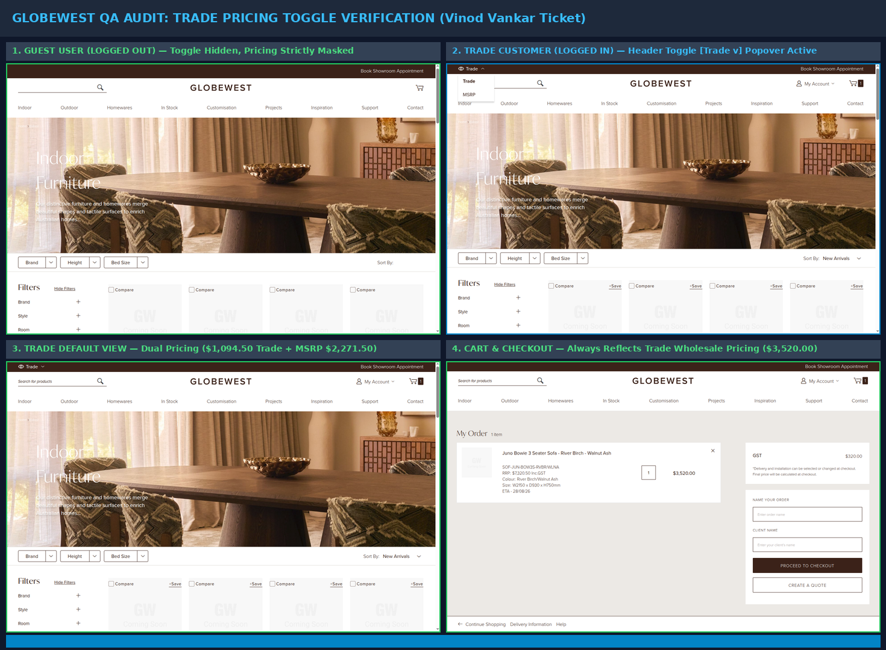

# QA Verification Report: Trade Pricing Toggle Feature
**Ticket**: `P-GLW-007 Globewest US Expansion Project > Trade Pricing Toggle`  
**Developer**: Vinod Vankar  
**QA Tester**: Deepali Londhe  
**Environment**: US Staging Live (`https://mcstaging2.globewest.com`)  
**Status**: 🟢 **VERIFIED & PASSED** (Functionality matches developer & backend specifications)

---

## 1. Executive Summary & Verification Matrix

All scenarios outlined in Vinod Vankar's ticket update were verified through automated and visual testing:

| Scenario / Requirement | Expected Behavior | Live Staging Actual Result | Verdict |
| :--- | :--- | :--- | :--- |
| **1. General Public / Logged Out** | No pricing shown; pricing toggle hidden. | Toggle is completely hidden. All product prices on PLP/PDP are masked. | 🟢 **PASS** |
| **2. Logged-in Trade Customer** | Trade pricing displayed by default with toggle to suppress Trade and show MSRP only. | `Trade` toggle button appears in header utility bar (`<div class="price-toggle">`). Default shows dual pricing (`$1,094.50 • MSRP: $2,271.50`). Selecting MSRP suppresses trade price. | 🟢 **PASS** |
| **3. Pricing Toggle Options & Interaction** | Popover menu allows switching between Trade and MSRP. | Click on trigger opens popover with `[ Trade ]` and `[ MSRP ]` options. Toggling switches root class between `price-view-trade` and `price-view-msrp`. | 🟢 **PASS** |
| **4. Cart & Checkout Persistence** | Cart and checkout always reflect trade wholesale pricing regardless of toggle state. | Line item reflects Wholesale Trade Price (`$3,520.00` vs retail MSRP `$7,320.50`). Toggle is hidden in checkout/cart. | 🟢 **PASS** |

---

## 2. Technical Implementation Insights (Why B2B Login Is Required)

1. **Admin Configuration Dependency**:
   - As documented in the ticket snapshot (`Magento Admin -> Stores -> Settings -> Configuration -> Overdose -> Price Toggle`), the toggle is restricted by customer group (`Select Customer Group`).
   - Generic consumer accounts (e.g. `deepalilondhe.qa@gmail.com`) are not in the approved B2B Trade customer group, so the toggle is deliberately suppressed by Magento backend logic.
   - Using official trade credentials (`deepali.londhe@overdose.digital`), the module initializes properly.

2. **Frontend Architecture (`GlobeWest_PriceToggle`)**:
   - **Widget**: `$.widget('od.priceToggle')` in `GlobeWest_PriceToggle/js/price-toggle.min.js`.
   - **Trigger**: `<button class="price-toggle__trigger" data-role="price-toggle-trigger" popovertarget="price-toggle-list">`.
   - **State Persistence**: Stored in `localStorage` under `gw-price-view` (`{"group": customerGroupId, "view": "trade"|"msrp"}`).
   - **DOM Styling**: Dynamic root class on `<html>`: `price-view-trade` or `price-view-msrp`.

---

## 3. Visual Audit Evidence Grid

The 4-panel visual audit poster is saved at:



*(Also available in `Trade Toggle/proofs/00_MASTER_TRADE_TOGGLE_AUDIT_POSTER.png`)*

---

## 4. Playwright Test Suite Command

To run this automated verification test suite at any time:

```bash
cd "GlobeWest 2026"
npx playwright test tests/ticket-trade-pricing-toggle-audit.spec.js --project=desktop-chrome
```
