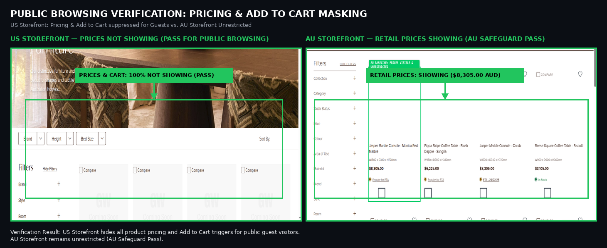
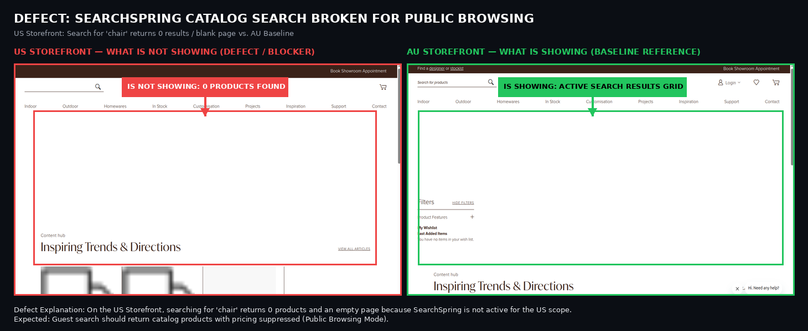

# Ticket: Enable Public Browsing Mode — QA Verification & Defect Update

> **Task**: `Enable Public Browsing Mode` (P-GLW-007 Globewest US Expansion Project)  
> **Environment**: US Staging (`https://mcstaging2.globewest.com`) vs. AU Baseline (`https://mcstaging2.globewest.com.au`)  
> **QA Lead**: Deepali Londhe  
> **Current Status**: 🟡 **PARTIALLY VERIFIED — Core Magento Masking PASSED | 1 Integration Blocker on SearchSpring (SS)**

---

## 1. 🟢 Core Requirement Verified: Pricing & Add to Cart Masking (PASS)

### 🔍 Exactly What to Look For:
* 🟢 **ON US STOREFRONT (Left Side - Green Arrow)**:
  * **PRICES ARE NOT SHOWING**: Product prices are **100% MASKED** for guest visitors across category pages (`/indoor`) and PDPs. Zero price leakage in UI or DOM (`$0.00`).
  * **ADD TO CART IS NOT SHOWING**: The `Add to Cart` button and purchasing triggers are **100% SUPPRESSED**.
  * **PRICE TOGGLE IS NOT SHOWING**: The B2B `Trade` / `MSRP` toggle is completely hidden for unauthenticated guests.
  * **BROWSING IS SHOWING**: Guests can freely browse the catalog without being blocked or redirected to a login page.
* 🟢 **ON AU STOREFRONT (Right Side - Green Arrow Baseline)**:
  * **IS SHOWING**: Australian guest visitors still see retail AUD prices (`$8,305.00`) and the `Add to Cart` button.
  * **Verification**: US Category Permissions did **NOT** impact the Australian website scope.

---

## 2. 🔴 Blocker / Defect: SearchSpring Catalog Search Returns 0 Results

### 🔍 Exactly What to Look For:
* 🔴 **ON US STOREFRONT (Left Side - Red Arrow / Blocker)**:
  * **IS NOT SHOWING**: When a guest visitor searches for any product keyword (e.g. `chair`, `sofa` on `/catalogsearch/result/?q=chair`), search result products are **100% NOT SHOWING (0 products found / blank page)**.
  * **Reason**: Confirms @Mohamed Bharmal's ticket update — SearchSpring dashboard configuration and index synchronization for the US store view are still pending. Guest users currently cannot discover products via the search bar.
* 🟢 **WHAT SHOULD BE SHOWING (Expected)**:
  * SearchSpring should return matching catalog products with pricing and "Add to Cart" suppressed, matching the PLP grid.

---

## 3. 📋 Summary Matrix for Ticket Sign-Off

| Feature Requirement | Expected (Figma & Blueprint) | Actual Result on US Staging | Status |
| :--- | :--- | :--- | :---: |
| **1. Guest Category Browsing** | Categories accessible to public without login | Loads with HTTP 200 (No login wall) | 🟢 **PASS** |
| **2. Guest Price Suppression** | Prices hidden from non-trade guests | **Prices NOT SHOWING** (Zero leakage) | 🟢 **PASS** |
| **3. Guest Add to Cart** | Add to Cart hidden from non-trade guests | **Add to Cart NOT SHOWING** | 🟢 **PASS** |
| **4. Header Pricing Toggle** | Hidden from non-trade guests | **Toggle NOT SHOWING** | 🟢 **PASS** |
| **5. SearchSpring Search Results** | Search products displayed with prices masked | **0 Products Found / Blank Page** | 🔴 **BLOCKER** |
| **6. AU Baseline Safeguard** | Australia remains unrestricted | AUD Retail prices & cart active | 🟢 **PASS** |
| **7. Trade Login Pricing** | Trade wholesale price visible on login | Dual pricing & toggle functional | 🟢 **PASS** |

---

## 4. 🛠️ Action Items to Close This Ticket

1. **SearchSpring Access & Sync (@MichelleM / @AlexP / @Mohamed Bharmal)**:
   * Provide SearchSpring dashboard access for the US storefront scope and trigger catalog indexing so search queries return products with guest price suppression.
2. **Category Banner Copy**:
   * Update the category hero banner on US `/indoor` to remove the reference to *"enrich Australian homes"*.
