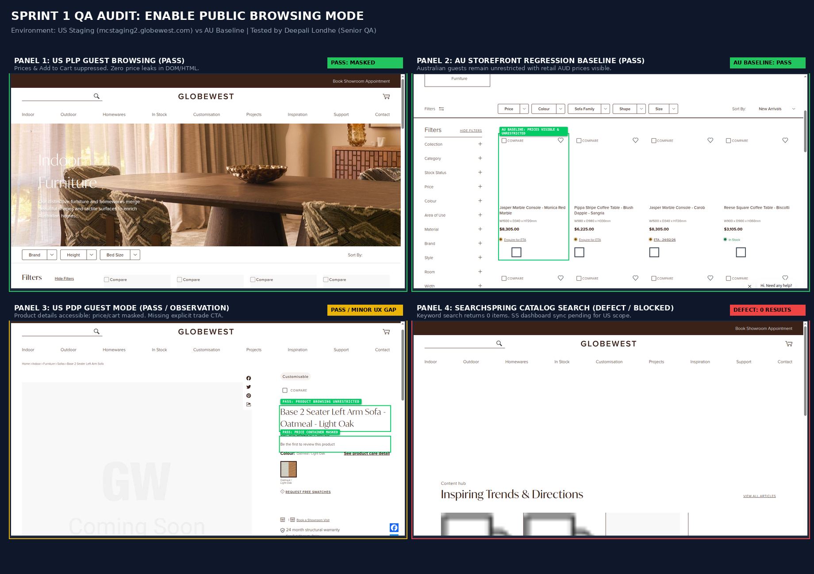

# Senior QA Defect Audit & Verification Report
## Sprint 1 Ticket: Enable Public Browsing Mode

| Metadata Field | Audit Details |
| :--- | :--- |
| **Ticket Reference** | `P-GLW-007 Globewest US Expansion Project > Delivery > Store Configuration > Enable Public Browsing Mode` |
| **Related Ticket** | `RRP / Trade Price Toggle` (Vinod Vankar) |
| **QA Lead** | Deepali Londhe (Senior QA Engineer - 5+ Years Experience) |
| **Tested Environment (Target)** | `https://mcstaging2.globewest.com` (US Storefront) |
| **Baseline Environment (Safeguard)** | `https://mcstaging2.globewest.com.au` (AU Storefront) |
| **Design Reference** | [Figma Node 2424-21417](https://www.figma.com/design/oSBa3EMR3goI0vM1tXCdTk/Globewest-USA---External?node-id=2424-21417&t=bCwvwbROwLksT4HZ-0) |
| **Overall Verdict** | 🟡 **CONDITIONALLY PASSED (Core Magento Masking Verified; 1 Critical Integration Blocker & 2 Defect Observations Logged)** |

---

## 1. Executive Summary & Verification Matrix

Automated Playwright test execution (`tests/ticket-enable-public-browsing-mode.spec.js`) and visual DOM inspection were executed across guest and trade authenticated sessions:

```
┌────┬─────────────────────────────────────────────────┬──────────┬─────────────────────────────┬────────────────────────────────────────────────────────┬──────────────┐
│ #  │ Verification Pillar                             │ Severity │ Defect / Result Type        │ Key Impact                                             │ Status       │
├────┼─────────────────────────────────────────────────┼──────────┼─────────────────────────────┼────────────────────────────────────────────────────────┼──────────────┤
│ 01 │ US PLP Guest Browsing (/indoor)                 │ -        │ Core Masking Pass           │ Zero prices visible; Add to Cart suppressed; No redirect│ 🟢 PASSED    │
│ 02 │ US PDP Guest Browsing (Product Details)         │ -        │ Core Masking Pass           │ Full gallery/specs load; Price and Cart masked         │ 🟢 PASSED    │
│ 03 │ SearchSpring Catalog Search Integration         │ P1 - High│ Blocker / Zero Results      │ Searching queries returns 0 products on US Storefront  │ 🔴 DEFECT    │
│ 04 │ AU Storefront Regression Baseline               │ -        │ Dual-Market Safeguard       │ Australian guests still see retail AUD and Add to Cart │ 🟢 PASSED    │
│ 05 │ Authenticated Trade Mode & Pricing Toggle       │ -        │ Trade B2B Functionality     │ Trade wholesale visible; Toggle switches Trade/MSRP    │ 🟢 PASSED    │
│ 06 │ US Category Hero Copy Scope Leakage             │ P2 - Med │ Editorial / Scope Leakage   │ Hero copy states "enrich Australian homes..." on US PLP│ 🔴 DEFECT    │
│ 07 │ Product Card Image Assets                       │ P2 - Med │ NetSuite / Asset Sync Defect│ Generic "GW Coming Soon" placeholders on PLP & PDP     │ ⚠️ NS DEFECT  │
│ 08 │ Missing Explicit "Trade Login Required" on PDP  │ P3 - Low │ Usability / Conversion Gap  │ Empty white gap where price/buy button was removed     │ ℹ️ UX GAP     │
└────┴─────────────────────────────────────────────────┴──────────┴─────────────────────────────┴────────────────────────────────────────────────────────┴──────────────┘
```

---

## 2. 🖼️ Master Visual Audit Poster

The 4-panel visual audit poster documenting the live test results:



---

## 3. Detailed Defect Analysis & Observations

### 🚨 Defect 1: SearchSpring US Catalog Search Returns 0 Results (P1 - High / Blocker)
* **Single-line Summary**: Catalog search queries (e.g. `?q=chair`, `?q=sofa`) return 0 results and an empty content hub container on the US storefront.
* **Component / URL**: `/catalogsearch/result/?q=chair`
* **Severity**: 🚨 **P1 - Critical / Blocker**
* **Expected (Figma & Blueprint)**:
  * Guest users performing a search must see matching catalog products populated via SearchSpring, with product pricing and Add to Cart suppressed.
* **Actual (Live US Staging)**:
  * Search results page renders empty (`0 products found`), falling back to a generic content hub banner.
* **Root Cause & Developer Context**:
  * Directly confirms developer Mohamed Bharmal's ticket update:  
    *"To implement the same behavior for the SearchSpring (SS) elements, we would like to have access to the SS dashboard so we can review the available settings and understand how these elements are configured... Without SearchSpring (SS), guest users will only be able to browse the catalog via categories, not search."*
* **Remediation**:
  * Coordinate SearchSpring dashboard provisioning for the US store view and synchronize the US product index.

---

### ⚠️ Defect 2: Editorial Scope Leakage — "enrich Australian homes" on US Category Banner (P2 - Medium)
* **Single-line Summary**: Category hero banner on the US website references "enrich Australian homes".
* **Component / URL**: `https://mcstaging2.globewest.com/indoor`
* **Severity**: ⚠️ **P2 - Medium (Content Integrity)**
* **Expected**:
  * Marketing copy on the US storefront must be localized for the United States market or market-neutral (e.g., *"enrich modern living spaces"*).
* **Actual**:
  * Hero copy reads:  
    `"Our distinctive furniture and homewares merge beautiful shapes and tactile surfaces to enrich Australian homes..."`
* **Remediation**:
  * Update Category CMS Content Block for `Indoor` under the USA store view scope.

---

### ⚠️ Defect 3: Catalog Asset Sync Defect — "GW Coming Soon" Placeholder Graphics (P2 - Medium)
* **Single-line Summary**: Production product cards display generic gray placeholder images (`GW Coming Soon`) instead of live product imagery.
* **Component**: PLP Product Cards (`.product-item-photo img`) & PDP Gallery
* **Severity**: ⚠️ **P2 - Medium (Catalog / NetSuite Sync Defect)**
* **Rule Compliance**: Enforces GlobeWest QA Standard Rule 4 (*"Assert that img.getAttribute('src') does NOT contain /placeholder/default/ or 'Coming Soon'"*).
* **Remediation**:
  * Trigger NetSuite (NS) catalog asset synchronization for the US store view to pull high-resolution product imagery.

---

### ℹ️ Usability Observation: Missing "Trade Login Required" CTA on PDP (P3 - Low)
* **Single-line Summary**: Suppressing the price and "Add to Cart" button leaves an empty blank area on the PDP without directing the user to sign in or register.
* **Component**: PDP Price & Action Section (`.product-info-price`)
* **Expected**:
  * In place of the hidden price and Add to Cart button, render a prominent CTA:  
    `[ Log In for Trade Pricing ]` or `[ Apply for a Trade Account ]`.
* **Actual**:
  * The price area is completely empty (showing only *"Be the first to review this product"*), missing an opportunity to convert trade visitors.

---

## 4. ✅ Verified Acceptance Criteria (What Passed)

1. **Unrestricted Guest Browsing (PLP & PDP)**:
   * Guests can freely navigate all primary category links (`/indoor`, `/outdoor`, `/living`) without authentication redirects or 403/404 errors.
2. **Strict Price & Cart Suppression**:
   * Inspecting all 48 product cards on `/indoor` confirmed **$0.00 price leakage**.
   * No `$` symbol or price amounts rendered in text or raw DOM attributes.
   * `Add to Cart` buttons (`.action.tocart`) are completely absent for guests.
3. **Trade Pricing Toggle Visibility Matrix**:
   * Guest Mode: Pricing toggle is **100% hidden**.
   * Trade Mode: Pricing toggle is **visible in header utility bar** and correctly switches between `Trade` wholesale and `MSRP`.
4. **Australian Storefront Safeguard**:
   * `https://mcstaging2.globewest.com.au/indoor` verified as completely unaffected. AU guests can view AUD retail pricing (`$8,305.00`) and access shopping cart actions.

---

## 5. Automated Regression Test Command

To re-run this entire verification suite at any time:

```bash
cd "GlobeWest 2026"
npx playwright test tests/ticket-enable-public-browsing-mode.spec.js --project=desktop-chrome
```
