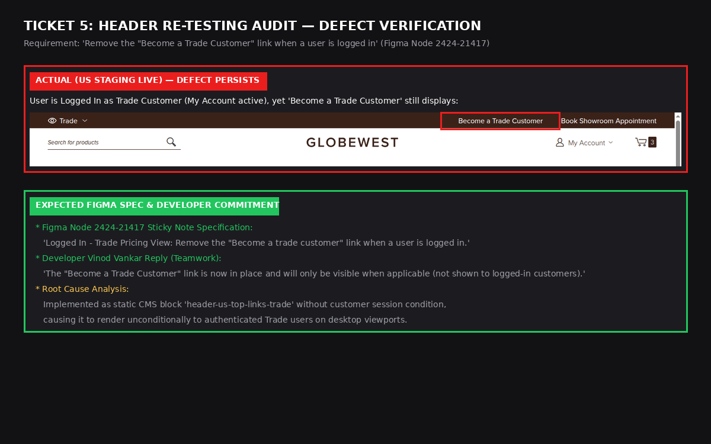
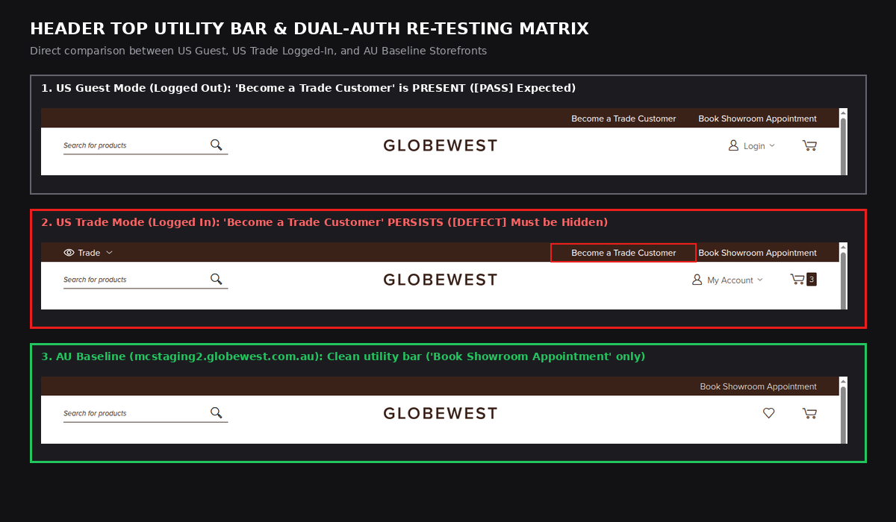

# Header Ticket Re-Testing & Verification Report

| Metadata | Details |
|---|---|
| **Ticket Reference** | P-GLW-007 Globewest US Expansion Project > Delivery > Header |
| **Developer Update Under Review** | Vinod Vankar deployment of `header-us-top-links-trade` & "Become a Trade Customer" |
| **Target Test URL (US Staging)** | `https://mcstaging2.globewest.com` |
| **Baseline Reference URL (AU)** | `https://mcstaging2.globewest.com.au` |
| **Design Reference** | [Figma Design Node 2424-21417](https://www.figma.com/design/oSBa3EMR3goI0vM1tXCdTk/Globewest-USA---External?node-id=2424-21417) |
| **Audit Date** | September 17, 2026 |
| **Overall Re-test Outcome** | ⚠️ **PARTIAL PASS / DEFECT PERSISTS ON LOGGED-IN TRADE STATE** |

---

## Executive Summary of Re-Testing Findings

```
┌───────────────────────────────────────────────────────────────────┬──────────────┬───────────────────────────────┐
│ Verification Area                                                 │ Status       │ Key Finding                   │
├───────────────────────────────────────────────────────────────────┼──────────────┼───────────────────────────────┤
│ 1. Guest Mode Desktop: "Become a Trade Customer" Link Added       │ 🟢 PASSED    │ Correctly points to US path   │
│ 2. Trade Mode Desktop: Suppression of "Become a Trade Customer"   │ 🔴 DEFECT    │ Link STILL VISIBLE to Trade   │
│ 3. Mobile Viewport (< 768px): CSS Media Query Hidden Rule         │ 🟢 PASSED    │ Hidden via mobile CSS class   │
│ 4. Australian "Outlet" Linkage (Shop Outlet)                      │ ⚠️ ACKNOWLEDGED│ Points to globewestoutlet.au  │
│ 5. Australian Production Domain Leak ("VIEW ALL ARTICLES")        │ 🔴 DEFECT    │ Points to mcprod.globewest.au │
│ 6. AU Baseline Parity: Top Utility Bar & Navigation Match         │ 🟢 ALIGNED   │ Logo, Search, Cart aligned    │
└───────────────────────────────────────────────────────────────────┴──────────────┴───────────────────────────────┘
```

---

## 1. 🔴 Defect: "Become a Trade Customer" Persists for Authenticated Trade Customers



* **Component**: Header Top Utility Bar (`.panel.header`)
* **Expected (Figma Node 2424-21417 & Developer Commitment)**:
  - Figma Spec: *"Logged In - Trade Pricing View: Remove the 'Become a trade customer' link when a user is logged in."*
  - Developer Vinod: *"The 'Become a Trade Customer' link is now in place and will only be visible when applicable (not shown to logged-in customers)."*
* **Actual (US Staging Live)**:
  - When logged in as an active Trade customer (user sees `👁 Trade ⌵` and `👤 My Account ⌵`), the top bar **still renders** `"Become a Trade Customer"` right next to `"Book Showroom Appointment"`.
* **Root Cause**:
  - CMS block `header-us-top-links-trade` is embedded statically in the header template without an auth session condition (`customer.isLoggedIn()`), causing it to display unconditionally to authenticated Trade users on desktop viewports.

---

## 2. 📸 Dual-Auth Matrix Comparison Proof



1. **US Guest Mode**: Renders `Become a Trade Customer` + `Book Showroom Appointment` (✅ Expected).
2. **US Trade Mode**: Renders `Become a Trade Customer` + `Book Showroom Appointment` (🔴 Defect: must be hidden).
3. **AU Baseline**: Renders clean top bar with `Book Showroom Appointment` only.

---

## 3. 🌐 Domain Links Verification

1. **Outlet Link**:
   - Live DOM contains: `"Shop Outlet" -> https://globewestoutlet.com.au/`.
   - As Vinod noted, this is pending client confirmation on whether a US clearance/outlet path will be established.
2. **AU Production Domain Leak**:
   - `"VIEW ALL ARTICLES" -> https://mcprod.globewest.com.au/blog`.
   - Expected: `https://mcstaging2.globewest.com/blog`.
