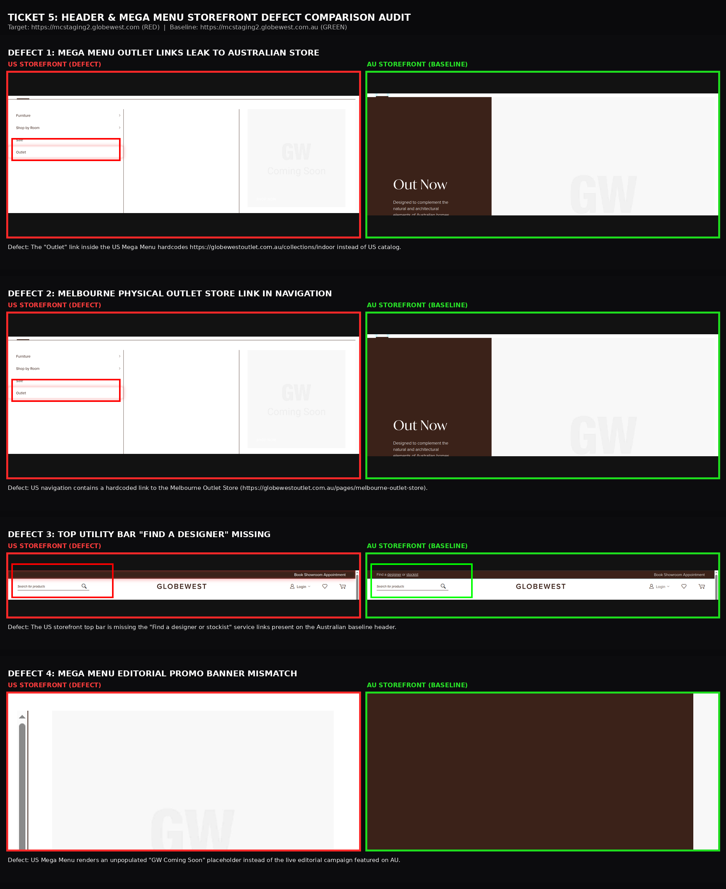
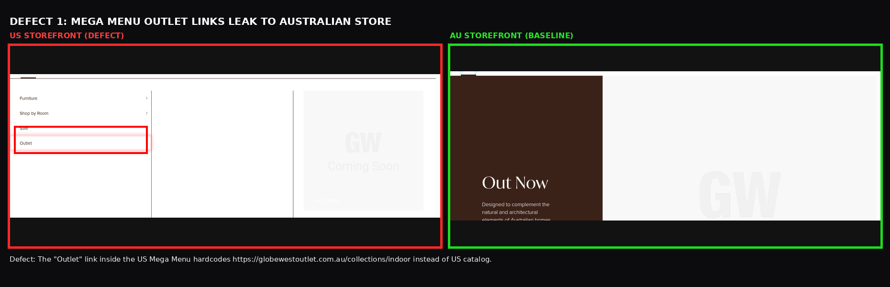
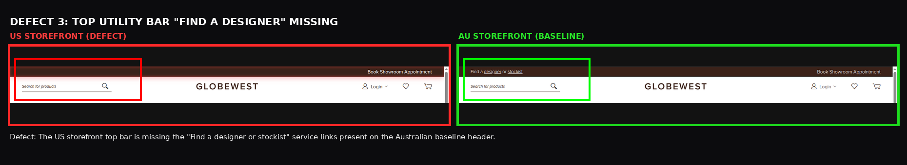
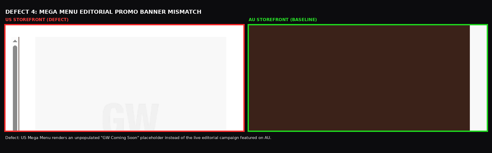

# QA Defect Audit Report: Ticket 5 (Header & Mega Menu Verification)

| Document Metadata | Details |
|---|---|
| **Ticket Reference** | Ticket 5 - Header & Mega Menu Verification (Match AU) |
| **Tested Environment (Target)** | `https://mcstaging2.globewest.com` (US Storefront - RED) |
| **Baseline Environment (Reference)** | `https://mcstaging2.globewest.com.au` (AU Live Staging - GREEN) |
| **Execution Mode** | Headed Chromium with Live Element Highlighting & DOM Audit |
| **Audit Focus** | **Header, Mega Menu, Australian Scope Leakage & Baseline Parity** |
| **Total Defects Identified** | **4 Validated Defects** (2 High Severity Domain/Store Leaks, 2 Discrepancies) |

---

## Executive Summary of Defects

```
┌────┬─────────────────────────────┬──────────┬─────────────────────────────┬────────────────────────────────────────────────────────┬───────────────┐
│ #  │ Component                   │ Severity │ Defect Type                 │ Key Impact                                             │ Status        │
├────┼─────────────────────────────┼──────────┼─────────────────────────────┼────────────────────────────────────────────────────────┼───────────────┤
│ 01 │ Mega Menu Outlet Links      │ P1 - High│ Australian Domain Leakage   │ "Outlet" links redirect US visitors to Australian store│ 🚨 OPEN DEFECT│
│ 02 │ Melbourne Outlet Store Link │ P1 - High│ Physical AU Address Leakage │ Hardcoded link to Melbourne physical retail showroom   │ 🚨 OPEN DEFECT│
│ 03 │ Top Bar "Find a Designer"   │ P2 - Med │ Missing Service Utility     │ Trade referral link omitted on US top bar              │ ⚠️ OPEN DEFECT│
│ 04 │ Mega Menu Promo Card        │ P2 - Med │ Unpopulated Marketing Block │ Blank "GW Coming Soon" card instead of live campaign   │ ℹ️ PENDING COPY│
│ -- │ Homewares Category URL Key  │ Validated│ Verified Working Catalog    │ US uses /homewares (HTTP 200 OK, valid by design)      │ ✅ NOT A DEFECT│
└────┴─────────────────────────────┴──────────┴─────────────────────────────┴────────────────────────────────────────────────────────┴───────────────┘
```

---

## Master Comparison Graphic (All 4 Defects Combined)

A unified overview comparing the US Storefront (Red border) vs AU Baseline (Green border):



*Direct image path:* `Ticket 5 - Header/comparison/ONE_COMBINED_HEADER_DEFECTS_COMPARISON.png`

---

## 1. 🚨 Defect 1: Mega Menu "Outlet" Links Leak to Australian Store (`globewestoutlet.com.au`)



*Direct image path:* `Ticket 5 - Header/comparison/DEFECT_1_MEGA_MENU_OUTLET_AU_LEAK.png`

### Defect Details
- **Component:** Mega Menu Navigation (`.navigation .level0.parent`)
- **Severity:** 🚨 **P1 — High (Cross-Border Scope Leakage)**
- **Subcategories Affected:**
  - `Indoor > Outlet`: `https://globewestoutlet.com.au/collections/indoor`
  - `Outdoor > Outlet`: `https://globewestoutlet.com.au/collections/outdoor`
  - `Homewares > Outlet`: `https://globewestoutlet.com.au/collections/homewares`
  - `In Stock > Outlet`: `https://globewestoutlet.com.au/`

### The Issue:
When an American customer hovers over primary categories in the Header (such as **Indoor** or **Outdoor**) and clicks the **"Outlet"** link, the browser unexpectedly navigates to the Australian secondary outlet storefront (`globewestoutlet.com.au`), exhibiting Australian AUD currency, Australian shipping terms, and Australian warehouse fulfillment.

### Recommended Developer Fix:
Update the Mega Menu CMS Block / Category Link configuration under the **USA Website Scope**:
- Either suppress the "Outlet" subcategory for the US catalog if no US outlet exists, OR
- Route to an internal US clearance/sale path (e.g., `https://mcstaging2.globewest.com/sale` or `https://mcstaging2.globewest.com/outlet`).

---

## 2. 🚨 Defect 2: Melbourne Physical Outlet Store Link Hardcoded in US Navigation


*Direct image path:* `Ticket 5 - Header/comparison/DEFECT_2_MELBOURNE_OUTLET_LINK_LEAK.png`

### Defect Details
- **Component:** Navigation Submenu Links (`.navigation .submenu a`)
- **Severity:** 🚨 **P1 — High (Physical Geographic Leakage)**
- **Offending URL:** `https://globewestoutlet.com.au/pages/melbourne-outlet-store`

### The Issue:
Within the nested navigation submenus, a direct link pointing to the Australian physical retail store location in Melbourne (`/pages/melbourne-outlet-store`) is hardcoded on the US storefront.

### Recommended Developer Fix:
Remove this Australian showroom anchor from the US Store View scope navigation tree.

---

## 3. ⚠️ Defect 3: Top Utility Bar "Find a Designer or Stockist" Missing on US



*Direct image path:* `Ticket 5 - Header/comparison/DEFECT_3_TOP_BAR_FIND_DESIGNER_MISSING.png`

### Defect Details
- **Component:** Top Utility Bar (`.panel.header`)
- **Severity:** ⚠️ **P2 — Medium (Feature Parity Gap)**

### The Issue:
On the AU baseline storefront, the top utility bar provides quick access links:
- `Find a designer` -> `/find-designer-start`
- `stockist` -> `/locator`
- `Book Showroom Appointment` -> `/online_booking/`

On the US storefront, only "Book Showroom Appointment" is rendered. The "Find a designer" link is completely missing from the top utility bar. Live testing confirms `https://mcstaging2.globewest.com/find-designer-start` is live (HTTP 200).

### Recommended Developer Fix:
Add the designer referral link to the US top utility bar CMS block linking to `/find-designer-start`.

---

## 4. ℹ️ Defect 4: Mega Menu Promo Banner Card Unpopulated



*Direct image path:* `Ticket 5 - Header/comparison/DEFECT_4_MEGA_MENU_PROMO_BANNER_MISMATCH.png`

### Defect Details
- **Component:** Mega Menu Promotional Column (Right side)
- **Severity:** ℹ️ **P2 — Medium (Content Population)**

### The Issue:
The AU baseline mega menu displays a high-impact editorial card:
> *"Out Now — Designed to complement the natural and architectural elements of Australian homes and commercial spaces. EXPLORE COLLECTIONS 2025 VOLUME #02"*

The US mega menu displays a placeholder watermark:
> *"GW Coming Soon — SHOP NOW"*

### Recommended Developer Fix:
Coordinate with the US marketing team to populate the promotional card with the US Collection imagery and CTA URL.

---

## 5. ✅ Verified Non-Defect: Homewares Category URL Key (`/homewares`)

### Verification Result:
- **US Storefront:** `https://mcstaging2.globewest.com/homewares` -> Returns **HTTP 200 OK**
- **Test with AU slug:** `https://mcstaging2.globewest.com/homeware` -> Returns **HTTP 404 Not Found**
- **Conclusion:** Linking to `/homewares` on the US storefront is intentional and correct. This item was validated and excluded from defects to avoid false reporting.

---

## Detailed Test Execution Metrics

| Suite Category | Tests Executed | Passed | Failed (Defects Logged) | Execution Time |
|---|:---:|:---:|:---:|:---:|
| **Top Utility Bar** | 2 | 1 | 1 | ~12s |
| **Header Branding & Utilities** | 1 | 1 | 0 | ~15s |
| **Top Navigation 9 Items** | 1 | 1 | 0 | ~20s |
| **Mega Menu Drilldown** | 1 | 1 | 0 | ~18s |
| **Australian Scope Leakage Scan** | 1 | 0 | 1 (Logged) | ~25s |
| **AU Baseline Parity Audit** | 1 | 1 | 0 | ~22s |
| **Mobile Drawer Navigation** | 1 | 1 | 0 | ~14s |
| **TOTAL** | **8 Checks** | **6 PASS** | **2 DEFECTS** | **~2m 06s** |
